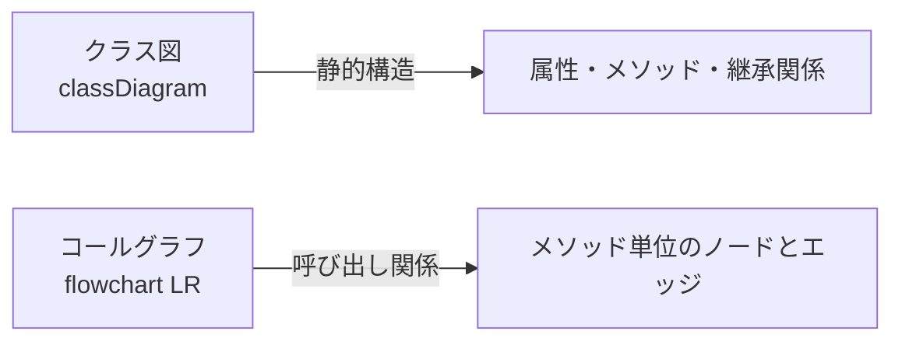

[ドキュメント](../README.md) > 解説

> **Diataxis: Explanation** — このツールがなぜこの設計になっているかを理解する。

# 解説: 設計の判断

## なぜ直接生成方式か（JSON 中間層を持たない理由）

コード → Mermaid 図の直接生成を採用している。「コード → metadata.json（中間層）→ Mermaid 図」の 2 フェーズ構成は採用しなかった。

**直接生成の利点**:
- 真実の源が 1 つになる（マスタ Mermaid ファイル = 唯一の正）
- 中間 JSON がコンテキストを圧迫しない（大規模コードで JSON が肥大化すると対話 UI のコンテキスト制限に引っかかる）
- 更新サイクルが 1 往復で完結する（コード → 図、中間変換ステップがない）

**直接生成の制約**:
- AI の抽出精度に依存する（静的解析ツールのような完全性は保証できない）
- チャンクを跨ぐ呼び出し関係は途中のチャンクでスタブとして保持し、後続チャンクで補完される

## なぜクラス図＋コールグラフの 2 枚構成か

単一の図に静的構造と呼び出し関係を混在させると粒度が混乱する。2 枚に分離することで責務を明確にする。

| 図 | 質問に答える |
|----|------------|
| クラス図 | 「このクラスはどんな構造をしているか」「どのクラスがどのクラスを継承しているか」 |
| コールグラフ | 「この API を変えたらどこに波及するか」「このメソッドはどこから呼ばれているか」 |

コールグラフは時系列を持たない点がシーケンス図と異なる。「A が B を呼ぶ」という事実のみを記録し、「いつ」「どの条件で」は含めない。

## シーケンス図をマスタに含めない理由

シーケンス図は「特定シナリオにおける時系列の相互作用」を描く動的図であり、コードベース全体を 1 枚にまとめることが意味的に成立しない。

**マスタ化できない理由**:
- シナリオ（起点メソッド・分岐の選択・深さ）は人間の意図による選択が必要
- 同じコードから無数のシーケンス図が描ける（全てをマスタ化しても保守できない）

**オンデマンド派生で十分な理由**:
- マスタ 2 枚が揃っていれば、コードを再投入せずに AI がシーケンス図を構成できる
- 「今この瞬間に必要なシナリオ」だけを生成すれば、保守コストをゼロに近づけられる

## なぜ一括投入型か（対話型入力モードを採用しない理由）

複数ターンに分けて入力を渡す対話型運用は採用しなかった。プロンプト全文 + マスタ + バンドルを 1 メッセージで投入する**一括投入型**を維持する。

**一括投入の利点**:
- 1 回の AI 推論で全入力を突き合わせるため、抽出漏れ・整合性崩れのリスクが最も低い
- 「全入力を揃えてから送信する」という単純なルールで運用できる

**対話型の問題**:
- 応答ごとに AI が中間要約・解釈・先走りを出しうる（品質劣化リスク）
- 品質を担保するにはガードプロンプトと利用者側の運用規律が別途必要になる

**再検討のトリガー**: 1 回の貼り付けが UI 側で物理的に扱えないほど大きくなった場合、または対話型でも品質を担保できるベストプラクティスが確立された場合。

## なぜ Mermaid か

| 比較対象 | 採用しない理由 |
|---------|-------------|
| PlantUML | ローカルに Java + Graphviz のインストールが必要 |
| Graphviz / DOT | VS Code 公式エクステンションのサポートが弱い |
| Mermaid | ブラウザのみで動作。GitHub / Obsidian / Markdown ネイティブ対応。LLM 生成の成功率が高い |

---

[← ドキュメント一覧](../README.md)
