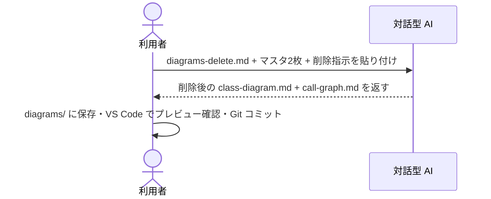

[code-dependency-analysis/](../index.md) > how-to

# How-to: エントリを削除する（Delete）

ソースコードからファイルやクラスを削除したとき、マスタ2枚から対応エントリを除去する。

---

## 概要フロー

---

## 手順

AI に以下を **1 メッセージで** 貼り付けて送信する。

1. `prompts/diagrams-delete.md` の全文
2. 既存の `diagrams/class-diagram.md` の全文
3. 既存の `diagrams/call-graph.md` の全文
4. 削除指示（自然言語）

応答から `class-diagram.md` / `call-graph.md` を `diagrams/` に上書き保存し、VS Code でプレビュー確認 → Git コミット。

---

## 削除指示の書き方

| 粒度 | 指示の例 |
| --- | --- |
| ファイル単位 | 「`src/auth/OldAuthManager.cpp` を削除」 |
| クラス単位 | 「クラス `LegacyUser` を削除」 |
| メソッド単位 | 「`AuthManager.oldLogin` を削除」 |
| パッケージ単位 | 「`src/legacy/` 配下を一括削除」 |
| 複数指定 | 「クラス `LegacyUser` と `DeprecatedToken` を削除」 |

指示が曖昧な場合、AI は「どれを削除対象と解釈したか」を冒頭で宣言してから処理する。意図と異なればその場で修正指示を出す。

---

## 注意

Upsert（`diagrams-upsert.md`）はエントリの「更新」であり、削除は行わない。コード削除後にそのまま Upsert しても古いエントリがマスタに残る。削除は必ず Delete プロンプトで行うこと。

---

## 関連

← [code-dependency-analysis/ に戻る](../index.md)

- マスタを更新するには → [update-diagrams.md](update-diagrams.md)
- Delete プロンプトの詳細な挙動 → [../reference/prompts.md](../reference/prompts.md)
