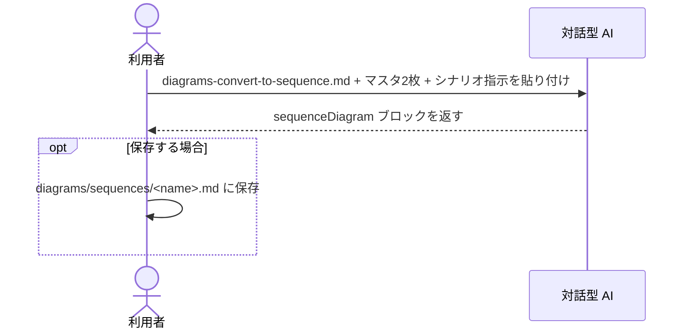

[code-dependency-analysis/](../index.md) > how-to

# How-to: シーケンス図を派生させる

マスタ2枚（クラス図・コールグラフ）から、特定シナリオのシーケンス図をオンデマンドで生成する。

---

## 概要フロー

---

## 手順

AI に以下を **1 メッセージで** 貼り付けて送信する。

1. `prompts/diagrams-convert-to-sequence.md` の全文
2. `diagrams/class-diagram.md` の全文
3. `diagrams/call-graph.md` の全文
4. シナリオ指示（自然言語）

AI が `sequenceDiagram` ブロックを含む Mermaid を返す。

---

## シナリオ指示の書き方

| 指定できる内容 | 例 |
| --- | --- |
| 起点メソッド | 「`AuthController.login` から始まる処理の時系列を描いて」 |
| スコープ絞り込み | 「auth パッケージ内部の相互作用だけ」 |
| 分岐の指定 | 「例外パス（認証失敗）のシナリオ」 |
| 深さの指定 | 「起点は `Main.run`、深さは 3 階層まで」 |

指示が曖昧な場合、AI は「起点を `<X>` と解釈しました」と宣言してから描く。

---

## 保存するかどうかの判断

| 用途 | 判断 |
| --- | --- |
| 設計レビュー・影響調査など今の作業だけで使う | 保存しない（使い捨て） |
| オンボーディング資料・設計書として継続参照する | `diagrams/sequences/<name>.md` に保存 |

---

## 関連

← [code-dependency-analysis/ に戻る](../index.md)

- シーケンス図をマスタに含めない設計理由 → [../explanation/design-decisions.md](../explanation/design-decisions.md)
- 派生プロンプトの仕様 → [../reference/prompts.md](../reference/prompts.md)
