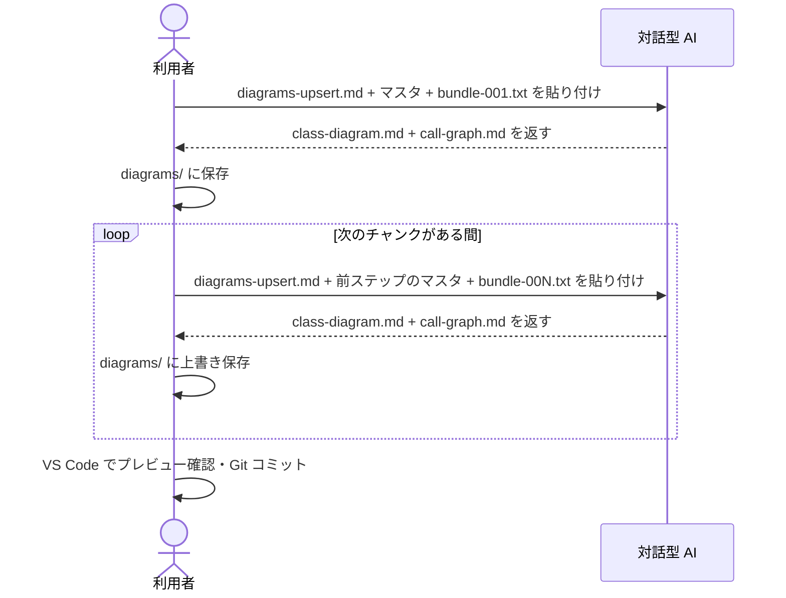

[code-dependency-analysis/](../index.md) > how-to

# How-to: マスタを更新する（Upsert）

コードを追加・変更したとき、マスタ2枚（クラス図・コールグラフ）を最新状態に更新する。

---

## 概要フロー



---

## 通常の更新

```bash
# 変更があったディレクトリをバンドル
python scripts/bundle.py --root ./src/auth --out bundle.txt
```

AI に以下を **1 メッセージで** 貼り付けて送信する。

1. `prompts/diagrams-upsert.md` の全文
2. 既存の `diagrams/class-diagram.md` の全文
3. 既存の `diagrams/call-graph.md` の全文
4. `bundle.txt` の内容

応答から `class-diagram.md` / `call-graph.md` を `diagrams/` に上書き保存する。

> バンドルに含まれないファイルのエントリは変更されない。パッケージ単位でバンドルを投入しても、他パッケージのエントリはマスタに保持される。

---

## 大規模コードをチャンク分割して投入する

コードが大きく 1 回の貼り付けに収まらない場合、`--max-chars` でチャンク分割してから繰り返し投入する。

```bash
python scripts/bundle.py --root ./src --out bundle.txt --max-chars 50000
# → bundle-001.txt, bundle-002.txt, ... が生成される
```

投入手順:

```text
1. bundle-001.txt を Upsert → class-diagram.md, call-graph.md を保存
2. 前ステップの出力をマスタとして bundle-002.txt を Upsert → 上書き保存
3. 全チャンクが終わるまで繰り返す
4. VS Code でプレビュー確認 → Git コミット
```

> チャンクごとに「既存マスタ = 前ステップの出力」を使うこと。初回投入のマスタを使い回すとエントリが失われる。

---

## 特定ディレクトリだけ更新する

```bash
python scripts/bundle.py --root ./src \
  --include 'auth/*' \
  --out bundle-auth.txt
```

---

## 関連

← [code-dependency-analysis/ に戻る](../index.md)

- エントリを削除するには → [delete-entries.md](delete-entries.md)
- マスタが肥大化した場合 → [split-diagrams.md](split-diagrams.md)
- bundle.py の全オプション → [../reference/bundle-py.md](../reference/bundle-py.md)
