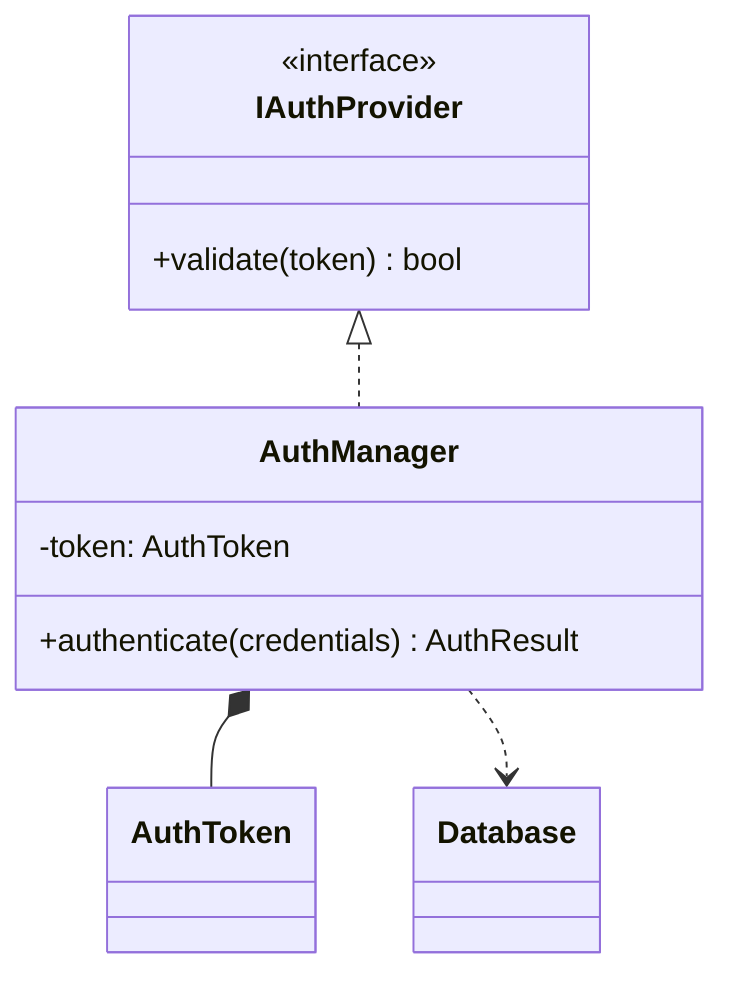
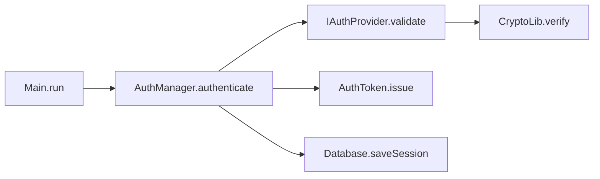

[code-dependency-analysis/](../index.md) > reference

# Reference: マスタ図仕様

マスタとして管理する2枚の図（クラス図・コールグラフ）の仕様、ファイルレイアウト、スケーリング方針。

---

## マスタ1: クラス図（`diagrams/class-diagram.md`）

| 項目 | 内容 |
| --- | --- |
| 標準 | UML 2.5 構造図 クラス図 |
| Mermaid 記法 | `classDiagram` |
| 表現対象 | クラス・属性（名前・型・可視性）・メソッド（名前・戻り値・引数・可視性）・継承 / 実装 / 集約 / 合成 / 依存 |
| 粒度 | 詳細設計〜実装レベルに統一 |
| 用途 | 既存実装の静的構造把握 |
| スコープ | プロジェクト全体 1 枚を第一目標（分割は下記参照） |

例:



---

## マスタ2: コールグラフ（`diagrams/call-graph.md`）

> コールグラフは UML 標準外の図。Mermaid の `flowchart` 記法を用いて静的呼び出し関係をマップとして表現する（UML にはメソッド呼び出し関係を網羅的に記述する標準図種が存在しないため）。

| 項目 | 内容 |
| --- | --- |
| Mermaid 記法 | `flowchart LR` |
| 表現対象 | メソッド単位のノード（`ClassName.methodName` 形式）と呼び出し関係（有向エッジ） |
| 粒度 | 呼び出しの有無のみ。時系列・条件分岐・ループ・戻り値は含めない |
| 用途 | 影響範囲調査・シーケンス図派生の入力情報 |
| スコープ | プロジェクト全体 1 枚を第一目標 |
| 外部ライブラリ | 末端ノードとして一段のみ表現（深追いしない） |

例:



---

## ファイルレイアウト

既定（分割なし）:

```text
diagrams/
├── class-diagram.md      # マスタ1: クラス図
├── call-graph.md         # マスタ2: コールグラフ
└── sequences/
    └── <name>.md         # 派生シーケンス図（保存したいものだけ）
```

分割後:

```text
diagrams/
├── package-diagram.md            # パッケージ間の全体俯瞰
├── class-<packageName>.md        # パッケージ単位のクラス図
├── call-graph-<packageName>.md   # パッケージ単位のコールグラフ
└── sequences/
    └── <name>.md
```

---

## スケーリング方針

「困ってから分割する」方針。既定は常に1枚。

| 図 | 分割トリガー |
| --- | --- |
| クラス図 | 50 クラス超 / 200 関係超、またはレンダリング不可 |
| コールグラフ | 300 ノード超、または AI が出力途中で打ち切られる |

分割・統合の操作は Upsert 時に指示で切り替える（テキストファイルなので再生成で可逆）。手順は [../how-to/split-diagrams.md](../how-to/split-diagrams.md) 参照。

---

## 出力フォーマット（AI → 利用者）

AI はファイルを直接書き出せないため、コピー＆ペーストで保存できる形式で出力する。

- ファイルごとに独立した外側コードブロック（` ```markdown … ``` `）で丸ごと囲む
- コードブロック直前にファイル名を見出しで明示（例: `### file: diagrams/class-diagram.md`）
- 複数ファイルを1回の応答にまとめてよいが、ファイル間は明確に区切る
- コピー用ブロック内にはファイルの**全文**を入れ、差分形式で返さない

---

## 関連

← [code-dependency-analysis/ に戻る](../index.md)

- プロンプトファイルの仕様 → [prompts.md](prompts.md)
- マスタ分割の手順 → [../how-to/split-diagrams.md](../how-to/split-diagrams.md)
- なぜ2枚構成か → [../explanation/two-diagram-design.md](../explanation/two-diagram-design.md)
