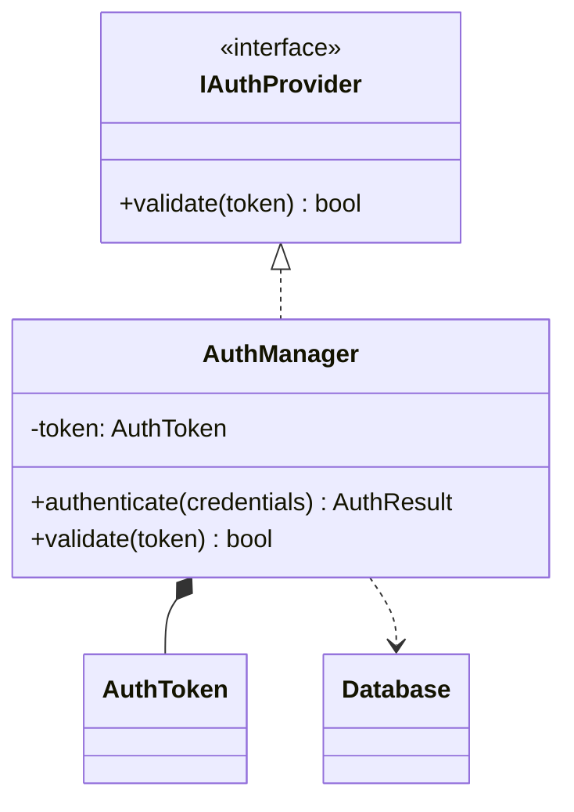

[ドキュメント](../README.md) > [チュートリアル](README.md) > コードから初めてマスタ図を作る

> **Diataxis: Tutorial（管理者向け）** — `bundle.py` でコードをバンドルし、AI でマスタ図を生成する。マスタ図を作成・保守する管理者向け。マスタ図の**使い方**から始めたい場合は [マスタ図を活用する](use-existing-diagrams.md) を参照。

# チュートリアル: コードから初めてマスタ図を作る

このチュートリアルでは、サンプルコードを使って最初の依存関係図（クラス図 + コールグラフ）を作るまでの全手順を体験する。所要時間: 約 10〜15 分。

## 前提

- Python 3.8 以上がインストール済み
- VS Code + Mermaid Chart 拡張（`MermaidChart.vscode-mermaid-chart`）がインストール済み
- Claude.ai / ChatGPT 等の対話型 AI にアクセスできる

## Step 1: サンプルコードを用意する

以下の内容で `sample/AuthManager.cpp` を作成する。

```cpp
#include "IAuthProvider.h"
#include "AuthToken.h"
#include "Database.h"

class AuthManager : public IAuthProvider {
private:
    AuthToken token;

public:
    AuthResult authenticate(Credentials credentials) {
        bool valid = validate(credentials.token);
        if (valid) {
            token = AuthToken::issue(credentials);
            Database::saveSession(token);
        }
        return AuthResult(valid);
    }

    bool validate(std::string token) override {
        return CryptoLib::verify(token);
    }
};
```

## Step 2: bundle.py でソースをバンドルする

このツールのルートディレクトリで以下を実行する。

```bash
python bundle.py --root ./sample --out bundle.txt
```

`bundle.txt` が生成される。中身はこのような MANIFEST 形式になっている。

```
=== MANIFEST ===
File: AuthManager.cpp
Classes: AuthManager

=== FILE: AuthManager.cpp ===
（ソースコードの内容）
```

## Step 3: AI にプロンプトとバンドルを貼り付ける

1. `diagrams-upsert.md` をテキストエディタで開き、**全文をコピー**する
2. 対話型 AI（Claude.ai 等）の入力欄に貼り付ける
3. 続けて「マスタ未作成」と入力する（初回のため）
4. 続けて `bundle.txt` の内容を全文貼り付ける
5. 送信する

> 貼り付け順は問わない。1 回のメッセージにまとめて送信すること。

## Step 4: 応答から 2 ファイルを取り出す

AI の応答に `### file: diagrams/class-diagram.md` と `### file: diagrams/call-graph.md` の 2 つのコードブロックが返ってくる。

1. プロジェクトに `diagrams/` フォルダを作成する
2. 各コードブロック右上のコピーアイコンをクリックしてコピー
3. それぞれ `diagrams/class-diagram.md`、`diagrams/call-graph.md` として保存する

## Step 5: VS Code でプレビューする

1. VS Code で `diagrams/class-diagram.md` を開く
2. コマンドパレット（`Cmd+Shift+P` / `Ctrl+Shift+P`）から「Mermaid: Preview Current File」を実行
3. クラス図が表示されることを確認する
4. 同様に `diagrams/call-graph.md` も確認する

サンプルコードから生成されたクラス図はこのようになる（例）:



## 完了

最初の依存関係図が作れた。次のステップ:

- コードを追加・変更したときは [図を更新する](../how-to/update-diagrams.md) を参照
- 特定の処理フローをシーケンス図で確認したいときは [シーケンス図を派生する](../how-to/derive-sequence.md) を参照

---

[← ドキュメント一覧](../README.md)
