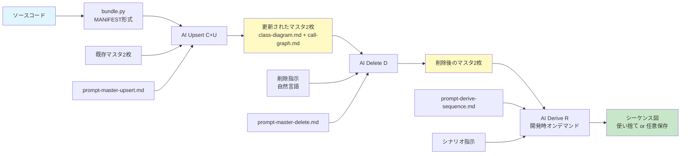
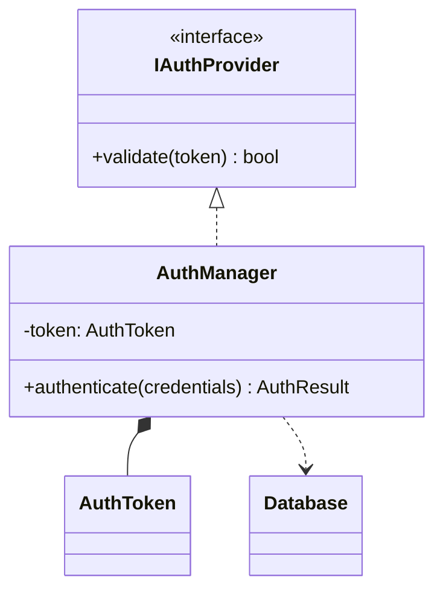
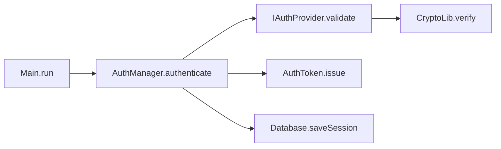

# 要件確認書: 対話型生成AIによるコード依存関係分析ツール

## 1. 背景・目的

コードベースの依存関係を可視化し、開発資料（設計レビュー・オンボーディング・アーキテクチャ分析）として活用するツールを構築する。職場環境においてインターネット接続・API キー利用・外部アカウント登録に制約があるため、対話型生成 AI（UI のみ）とローカルツールで完結する構成を前提とする。

## 1.1 方針転換の経緯（v1 → v2）

初版 v1（2026-04-15）は「コード → `metadata.json`（JSON中間層・マスタ）→ Mermaid 図」の 2 フェーズ構成を採用した。実運用で `metadata.json` のサイズが対話 UI 型 AI のコンテキストウィンドウを超過し、パッケージ単位の JSON 分割で回避する設計も運用コストが高かったため、v2（本書）では中間層を廃止し**「コード → Mermaid 図の直接生成」**に切り替える。

ただし v1 が採用していた **CRUD 操作に沿ったプロンプト分離**（Upsert / Delete / Read）は、繰り返し運用における利用者体験が良好だったため v2 でも踏襲する。v2 では Mermaid マスタ図自体を状態ストアに置き換えたうえで、以下 3 プロンプトの構成とする:

- `prompt-master-upsert.md`（Create + Update）
- `prompt-master-delete.md`（Delete）
- `prompt-derive-sequence.md`（Read / 派生）

v1 の設計資産（JSON スキーマ・旧 CRUD プロンプト・6 種の図テンプレート）は [`legacy/`](./legacy/) に退避し、将来の参照資産として残す。

## 2. 制約条件

| 項目 | 内容 |
|------|------|
| 利用可能な AI | 対話形式の生成 AI（UI のみ、API キー利用不可） |
| GitHub | 利用不可 |
| 外部アカウント | 利用不可 |
| 実行環境 | ローカル完結（VS Code + Python） |

## 3. スコープ

### 3.1 対象言語

| 言語 | 依存関係の記述形式 |
|------|---------------------|
| C++ | `#include`（ヘッダ）、継承、前方宣言 |
| Java | `import`、`extends` / `implements`、パッケージ宣言 |
| C# | `using`、`namespace`、継承・インターフェース実装 |

### 3.2 対象外

| 項目 | 理由 |
|------|------|
| 依存関係の自動修正 | スコープ外 |
| API を使った完全自動化 | UI のみ利用のため |
| クラウド同期・共有 | MermaidChart アカウント必須のため |
| PlantUML | Java ローカルインストールが必要 |
| Graphviz / DOT 形式 | VS Code 公式エクステンションが弱いため |
| メタデータ JSON の蓄積 | コンテキスト超過の実害あり（v1 の不採用理由） |
| Tier 2/3 図（状態機械図・コンポーネント図・ER 図・ユースケース図・アクティビティ図・配備図） | v2 ではマスタに含めない。必要になったら legacy/ 方式の復活または個別対応を検討 |

### 3.3 対象コードベースの規模

本プロジェクトの解析対象は大規模コードベースであることを前提とする。そのためマスタはプロジェクト全体 1 枚を第一目標としつつ、レンダリング限界に達したときのみパッケージ単位に分割する（§5.3 参照）。

## 4. 機能要件

### 4.1 全体アーキテクチャ

コードから **2 枚のマスタ図（クラス図・コールグラフ）を直接生成**し、それらを Git 管理の真実の源とする。マスタの保守は CRUD 操作に沿った 3 プロンプトで行う。シーケンス図はマスタに含めず、開発時にマスタ 2 枚から AI にオンデマンド派生させる。



### 4.2 マスタの定義

#### 4.2.1 マスタ 1: クラス図 (`diagrams/class-diagram.md`)

- **標準**: UML 2.5 構造図、クラス図
- **Mermaid 記法**: `classDiagram`
- **表現対象**: クラス・属性（名前・型・可視性）・メソッド（名前・戻り値・引数・可視性）・継承 / 実装 / 集約 / 合成 / 依存
- **粒度**: 詳細設計〜実装レベル（資料用抽象度と実装レベルを混在させない）
- **読者**: 開発者、設計レビュー担当、オンボーディング対象者
- **用途**: 既存実装の静的構造把握
- **更新頻度**: コード変更時に再生成
- **スコープ**: プロジェクト全体 1 枚を第一目標（分割は §5.3 参照）

例:


#### 4.2.2 マスタ 2: コールグラフ (`diagrams/call-graph.md`)

- **標準**: UML 標準外（Mermaid `flowchart` を用いた静的呼び出し関係マップ）
- **Mermaid 記法**: `flowchart LR` または `graph LR`
- **表現対象**: メソッド単位のノード（`ClassName.methodName` 形式）と呼び出し関係（有向エッジ）のみ
- **粒度**: 呼び出しの有無（存在の記録）のみ。時系列・条件分岐・ループ・戻り値は**含めない**
- **読者**: 開発者（影響範囲調査・依存追跡用）
- **用途**: 「この API を変えたらどこに波及するか」「この機能はどのメソッドから呼ばれているか」の網羅確認。シーケンス図派生時の入力情報
- **更新頻度**: コード変更時に再生成
- **スコープ**: プロジェクト全体 1 枚を第一目標（分割は §5.3 参照）
- **外部ライブラリ**: 末端ノードとして一段のみ表現（深追いしない）

例:


### 4.3 コールグラフの位置づけ（粒度混在アンチパターンを回避する根拠）

v1 ではコールグラフ（静的 `graph LR` による関数呼び出し表現）を「UML 標準外かつ粒度混在アンチパターン」として不採用とした。v2 ではこの判断を以下の根拠で修正する。

- **責務分離による粒度混在の回避**:
  クラス図 = 静的構造（属性・メソッド・継承）、コールグラフ = 静的呼び出し関係のみ、とファイルを分離することで、1 枚の図の中に異なる抽象レベルが混在する状況を作らない
- **シーケンス図との責務分離**:
  コールグラフは時系列を持たない呼び出しマップであり、シーケンス図（動的シナリオ）とは目的・読み方・含む情報が明確に異なる。したがって同一の「呼び出し表現」であっても粒度混在にはならない
- **静的抽出可能性**:
  クラス図・メソッド呼び出し関係はいずれも静的コード解析から抽出可能な Tier 1 要素であり、コード → マスタの自動化に適する

### 4.4 シーケンス図の扱い（マスタに含めない根拠）

シーケンス図はマスタに含めず、開発時にマスタ 2 枚 + シナリオ指示から AI にオンデマンド派生させる。

- **根拠**: シーケンス図は「特定シナリオにおける時系列の相互作用」を描く動的図であり、コードベース全体を 1 枚に統合することが意味的に成立しない。シナリオ（どの public API を起点にするか・どの分岐を採るか）は人間の意図に基づく選択が必要
- **派生元**: マスタ 2 枚が揃っていれば、AI は `call-graph.md` から呼び出しチェーンを抽出し、`class-diagram.md` から参加者（ライフライン）のクラス情報を補強してシーケンス図を構成できる。コードを再読み込みさせる必要はない
- **保存ポリシー**: 派生したシーケンス図は使い捨てを基本とし、恒常的に参照したいものだけ `diagrams/sequences/<name>.md` に保存する（Git 管理は任意）

### 4.5 出力形式（AI → 利用者）

AI は UI 上でファイル書き出しができないため、利用者がコピー＆ペーストで保存できる形式で出力させる。

- ファイルごとに独立した **外側コードブロック（```markdown … ```）で丸ごと囲んで出力** する（内側の Mermaid 記法はネストコードブロックとして ``` で表現）
- コードブロックの直前にファイル名を見出しで明示する（例: `### file: diagrams/class-diagram.md`）
- 複数ファイルを 1 回の応答にまとめてよいが、ファイル間は明確に区切る
- コピー用ブロック内には該当ファイルの**全文**（フロントマター含む）を入れ、差分形式で返さない

これにより利用者はコードブロックのコピーアイコン 1 クリックで各ファイルに上書き保存できる。

## 5. 非機能要件

### 5.1 可視化

- VS Code 上でローカルプレビューが可能であること
- 使用エクステンション: **Mermaid Chart**（公式、`MermaidChart.vscode-mermaid-chart`）
  - アカウント登録不要・ローカル完結
  - `.md` ファイル内の Mermaid コードブロックをリアルタイムプレビュー

### 5.2 出力形式

- ファイル形式: Markdown（`.md`）のみ
- Mermaid コードブロックとして記述
- Obsidian への貼り付け・転用が可能な形式

### 5.3 ファイル構成とスケーラビリティ

#### 既定レイアウト（1 マスタ 1 ファイル）

| パス | 役割 |
|------|------|
| `diagrams/class-diagram.md` | マスタ 1: クラス図（プロジェクト全体） |
| `diagrams/call-graph.md` | マスタ 2: コールグラフ（プロジェクト全体） |
| `diagrams/sequences/<name>.md` | 保存したい派生シーケンス図（任意、必要時のみ） |

#### 「困ってから分割する」方針

分割は必要になってから行う。既定は常に 1 枚。

**分割トリガー（いずれか該当時に検討）**:
- Mermaid レンダリングが著しく重い / 表示できない
- 可読性が下がる（クラス図で目安: 50 クラス超 / 200 関係超、コールグラフで目安: 300 ノード超）
- 生成 AI が出力途中で打ち切られる

**分割方針**:
- クラス図: パッケージ単位で `diagrams/class-<packageName>.md` + 全体俯瞰用 `diagrams/package-diagram.md`
- コールグラフ: パッケージ単位で `diagrams/call-graph-<packageName>.md`

**分割・統合の可逆性**:
マスタはコードではなく図（Mermaid テキスト）だが、生成源はコード。`prompt-generate-master.md` への指示粒度を切り替えれば再生成で統合も分割も可能。手動編集でも Mermaid 記法のテキストマージ / 分割は容易。この可逆性を前提に、運用初期の粒度選択は軽い判断で構わない。

### 5.4 入力サイズ制約への対応（v1 問題の再発防止）

- 入力は「コードチャンク + プロンプト」のみ。中間 JSON を持たないため、入出力は常にコンテキスト 1 回分に収まる
- 出力（マスタ 2 枚）は図ごとにファイルが独立し、累積してもコンテキストに押し寄せない
- `bundle.py` の `--max-chars` でチャンク分割を継続可能
- 複数チャンクにまたがる場合は「部分マスタを生成 → 人間 / AI がマージ」する手順をとる（§6 運用フロー参照）

### 5.5 環境

- 外部ネットワーク接続不要で動作すること
- 職場 PC への追加インストールは VS Code エクステンションのみ

## 6. 運用フロー

前提: `bundle.py` は大規模コードを複数チャンクに分割して出力する運用を想定する。マスタ更新は**チャンクごとに Upsert プロンプトを繰り返す**ことで実現する。1 回の AI コンテキストには「既存マスタ 2 枚 + 1 チャンク分のバンドル + プロンプト本文」だけが乗るため、コンテキスト超過を起こしにくい。

### 6.1 マスタ Upsert フロー（初回生成・継続更新の共通フロー）

```
1. bundle.py で対象ソースを MANIFEST 形式に変換（必要に応じて --max-chars でチャンク分割）
2. 対話 AI に以下をまとめて貼り付け:
    - prompt-master-upsert.md の全文
    - 既存マスタ 2 枚の全文（初回は「マスタ未作成」と明記）
    - バンドル（1 チャンク）
3. 応答から class-diagram.md / call-graph.md のコピー用ブロックを取り出し
   diagrams/ 配下に保存（既存ファイルを上書き）
4. 次のチャンクがあれば 2 に戻る（既存マスタは前ステップの出力を使う）
5. 全チャンクを投入し終えたら VS Code でプレビュー確認 → Git コミット
```

Upsert はバンドル内のファイル／クラスだけを上書き対象とし、バンドル外のエントリには触れない。これにより複数回に分けて投入してもマスタが失われない。

### 6.2 マスタ Delete フロー（不要エントリの掃除）

```
1. 対話 AI に以下を貼り付け:
    - prompt-master-delete.md の全文
    - 既存マスタ 2 枚の全文
    - 削除指示（自然言語: ファイル / クラス / メソッド / パッケージ単位）
2. 応答からコピー用ブロックを取り出し diagrams/ 配下に保存
3. VS Code でプレビュー確認 → Git コミット
```

### 6.3 シーケンス図派生フロー（開発時オンデマンド）

```
1. 対話 AI に以下を貼り付け:
    - prompt-derive-sequence.md の全文
    - マスタ 2 枚（class-diagram.md + call-graph.md）の全文
    - シナリオ指示（自然言語）
2. AI がコピー用コードブロックで sequenceDiagram を返す
3. 一時用途なら保存せず、残したいものだけ diagrams/sequences/<name>.md に保存
```

シナリオ指示の例:
- 「`AuthController.login` から始まる処理の時系列を描いて」
- 「auth パッケージ内部の相互作用だけ」
- 「例外パス（認証失敗）のシナリオ」

### 6.4 分割・統合切替フロー

- 分割したい: `prompt-master-upsert.md` のフローでバンドル投入時に「パッケージ単位に分割して、`class-<packageName>.md` と `call-graph-<packageName>.md` で返して。あわせて `package-diagram.md` も」と指示
- 統合したい: 同じく Upsert 時に「全パッケージを 1 枚に統合して」と指示
- いずれもマスタがテキストファイル（Mermaid .md）であるため差し替え容易

## 7. 補助ファイル

### 7.1 Python スクリプト

| スクリプト | 処理内容 |
|-----------|----------|
| `bundle.py` | 指定ディレクトリのファイルを MANIFEST 形式に変換して出力（v1 から継続利用） |

実行環境: Python 3.8 以上（標準ライブラリのみ使用）

### 7.2 AI 定型プロンプト

| ファイル | CRUD | 用途 | 入力 | 出力 |
|---------|------|------|------|------|
| `prompt-master-upsert.md` | C + U | マスタ 2 枚の追加・更新 | 既存マスタ 2 枚（任意）+ MANIFEST 形式のコード（1 チャンク） | 更新された `class-diagram.md` + `call-graph.md` |
| `prompt-master-delete.md` | D | マスタ 2 枚からエントリを削除 | 既存マスタ 2 枚 + 削除指示（自然言語） | 削除後の `class-diagram.md` + `call-graph.md` |
| `prompt-derive-sequence.md` | R | マスタからシーケンス図を派生 | マスタ 2 枚 + シナリオ指示 | `sequenceDiagram` ブロックを含む .md |

各プロンプトファイルはプロンプト本文のみを収めた自己完結型。**ファイル全文をそのまま対話 AI に貼り付けて使う**ことを想定している（利用者が「ここから貼る」と判断する必要はない）。使い方・指示例は [`README.md`](./README.md) に集約。

### 7.3 退避ファイル（参照用）

[`legacy/`](./legacy/) に v1 の設計資産を退避。詳細は [`legacy/README.md`](./legacy/README.md) 参照。

## 8. 未確定事項

- [ ] Python のバージョン・実行可否の最終確認（職場 PC）
- [ ] `bundle.py` の `--max-chars` 適正値（運用しながら調整）
- [ ] 大規模コードベースで複数チャンクに分割した際のマスタ統合手順の洗練（運用しながら調整）

## 9. 成功条件

- 対話 UI のみで完結する（CLI / API キー不要）
- マスタ 2 枚が Mermaid Chart 拡張 / 標準的な Markdown レンダラでそのまま表示できる
- マスタ更新が CRUD プロンプト（Upsert / Delete）の貼り付けだけで完結する
- 大規模コードは複数チャンクに分けて Upsert を繰り返せば 1 コンテキストに収まり続ける
- シーケンス図がマスタ 2 枚のみからオンデマンドで派生できる（コード再読込不要）
- 各プロンプトファイルはその全文を貼り付けるだけで動作する（利用者側の切り出し判断が不要）
- v1 の設計資産が `legacy/` 以下で参照可能

## 10. 検討した代替案

### 10.1 対話型入力モード（採用見送り）

**検討の背景**: 実装完了後、利用者から「入力データ（既存マスタ・バンドル）を複数ターンに分けて段階的に貼り付ける対話型運用」ができないかという相談があった。長大な貼付け操作を 1 回にまとめる負担を減らす意図。

**決定**: 今回は採用しない。現行の**一括投入型**（プロンプト全文 + 既存マスタ + バンドルを 1 メッセージで投入）を維持する。

**理由**:
- **品質最優先の方針に適合**: 一括投入は 1 回の AI 推論で全入力を突き合わせるため、抽出漏れ・整合性崩れのリスクが最も低い
- **対話型は中間劣化リスク**: 応答ごとに AI が中間要約・解釈・先走りを出しうる。これを抑制するガードプロンプト（「全入力が揃うまで出力開始しない」等）を追加で書く必要がある
- **運用規律の負担**: 対話型を品質損なわず運用するには利用者側にも「途中で余計な指示を差し込まない」等の規律が要る
- **現行 CRUD 3 プロンプトで十分シンプル**: 1 往復で完結する設計が利用者・AI 双方の迷いを減らしている

**再検討トリガー**:
- 1 回の貼付けが UI 側で物理的に扱えないほど大きくなった（ブラウザ固まり等）
- 利用者が貼付け工程で頻繁にミスを起こすようになった
- 対話型運用でも品質を担保するガードプロンプトのベストプラクティスが確立された

## 11. 付録: 記法選定の根拠

本文書の記法選定は UML 2.5 標準および Mermaid の GitHub/Markdown 標準に準拠する。

- **文書形式**: 規制対応なし・個人ツール・反復的運用のため SRS-lite（IEEE 830 構成を簡略化）を採用
- **Mermaid を第一選択とする理由**:
  - 環境依存がブラウザのみに収まる（PlantUML の Java + GraphViz 依存と比較して運用コストが低い）
  - GitHub / Obsidian / Markdown ネイティブ対応
  - LLM 生成の成功率が高く、対話 UI 型 AI との相性が良い
- **マスタにクラス図とコールグラフを採用する理由**:
  - いずれも静的コード解析で必要な情報を全て抽出可能な Tier 1 要素
  - 責務を「静的構造」と「呼び出し関係」に分離することで粒度混在アンチパターンを回避
- **シーケンス図を派生物とする理由**:
  - 静的情報を起点にして動的情報（シナリオ選択を要する図）を派生させる方が、1 回のコード読み込みで賄える
  - シーケンス図の時系列はシナリオごとに異なり、マスタ化が意味的に成立しにくい
- **粒度管理**: 各図で「システム境界・抽象レベル・読者・更新頻度」を §4.2 で事前明示
