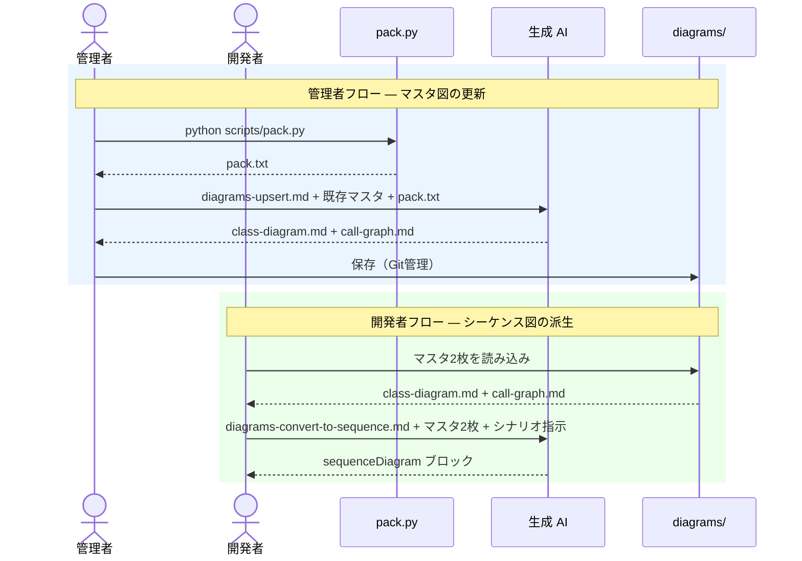

[diagram-keeper/](../index.md) > explanation

# Explanation: ツールの背景と全体設計

このツールを作った動機・制約条件・全体アーキテクチャ。各設計判断の出発点となる文脈。

---

## 背景と目的

コードベースの依存関係を可視化し、設計レビュー・オンボーディング・アーキテクチャ分析に活用できる資料を作りたかった。職場環境においてインターネット接続・API キー利用・外部アカウント登録に制約があるため、生成 AI（UI のみ）とローカルツールで完結する構成を前提として設計した。

## 全体アーキテクチャ

2 つのロール:

- **管理者**: `pack.py` でコードをバンドルし、AI でマスタを更新する
- **開発者（利用者）**: マスタを読み、AI でシーケンス図をオンデマンド派生させる

---

## 関連

← [diagram-keeper/ に戻る](../index.md)

- なぜ直接生成方式か → [direct-generation.md](direct-generation.md)
- なぜ 2 枚構成か → [two-diagram-design.md](two-diagram-design.md)
- シーケンス図をマスタに含めない理由 → [sequence-as-derived.md](sequence-as-derived.md)
- なぜ一括投入型か → [batch-input.md](batch-input.md)
- なぜ Mermaid か → [mermaid-choice.md](mermaid-choice.md)
