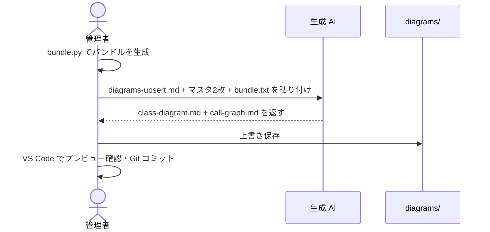

[diagram-keeper/](../index.md) > how-to

# How-to: マスタを更新する（Upsert）

コードを追加・変更したとき、マスタ2枚（クラス図・コールグラフ）を最新状態に更新する。

---

## 概要フロー



---

## 手順

```bash
# 変更があったディレクトリをバンドル
python scripts/bundle.py --root ./src/auth --out bundle.txt
```

AI に以下を **1 メッセージで** 貼り付けて送信する。

1. `prompts/diagrams-upsert.md` の全文
2. 既存の `diagrams/class-diagram.md` の全文
3. 既存の `diagrams/call-graph.md` の全文
4. `bundle.txt` の内容

応答から `class-diagram.md` / `call-graph.md` を `diagrams/` に上書き保存する。

> バンドルに含まれないファイルのエントリは変更されない。パッケージ単位でバンドルを投入しても、他パッケージのエントリはマスタに保持される。

---

## 関連

← [diagram-keeper/ に戻る](../index.md)

- コードが大きく1回に収まらない場合 → [update-with-chunks.md](update-with-chunks.md)
- 特定ディレクトリだけ更新する場合 → [update-partial.md](update-partial.md)
- エントリを削除するには → [delete-entries.md](delete-entries.md)
- マスタが肥大化した場合 → [split-diagrams.md](split-diagrams.md)
- bundle.py の全オプション → [../reference/bundle-py.md](../reference/bundle-py.md)
