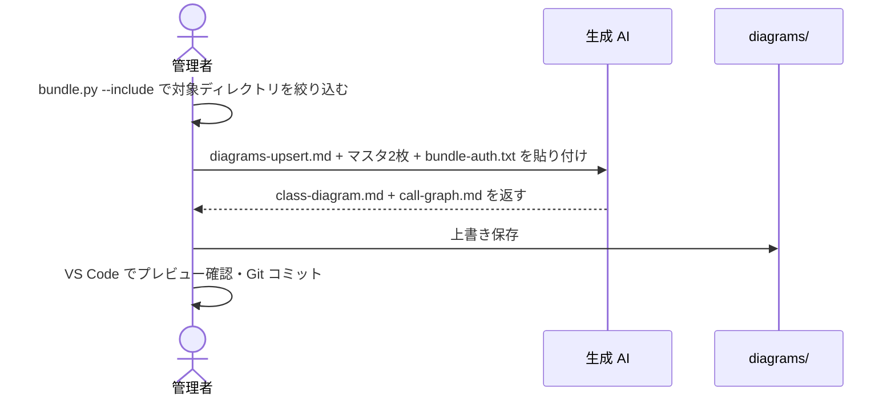

[diagram-keeper/](../index.md) > how-to

# How-to: 特定ディレクトリだけ更新する

変更が特定のパッケージ・ディレクトリに限定されている場合、`--include` オプションで対象を絞り込んでバンドルを生成する。

---

## 概要フロー



---

## 手順

```bash
python scripts/bundle.py --root ./src \
  --include 'auth/*' \
  --out bundle-auth.txt
```

AI に以下を **1 メッセージで** 貼り付けて送信する。

1. `prompts/diagrams-upsert.md` の全文
2. 既存の `diagrams/class-diagram.md` の全文
3. 既存の `diagrams/call-graph.md` の全文
4. `bundle-auth.txt` の内容

応答から `class-diagram.md` / `call-graph.md` を `diagrams/` に上書き保存する。

> `--include` で指定しなかったディレクトリのエントリはマスタに保持される。部分的な更新を安全に行える。

---

## --include の指定例

| 目的 | コマンド例 |
| --- | --- |
| 単一ディレクトリ | `--include 'auth/*'` |
| 複数ディレクトリ | `--include 'auth/*' --include 'core/*'` |
| サブディレクトリを再帰的に含める | `--include 'auth/**'` |

---

## 関連

← [diagram-keeper/ に戻る](../index.md)

- 通常の更新手順（全体を対象にする場合） → [update-diagrams.md](update-diagrams.md)
- コードが大きい場合のチャンク分割 → [update-with-chunks.md](update-with-chunks.md)
- bundle.py の全オプション → [../reference/bundle-py.md](../reference/bundle-py.md)
