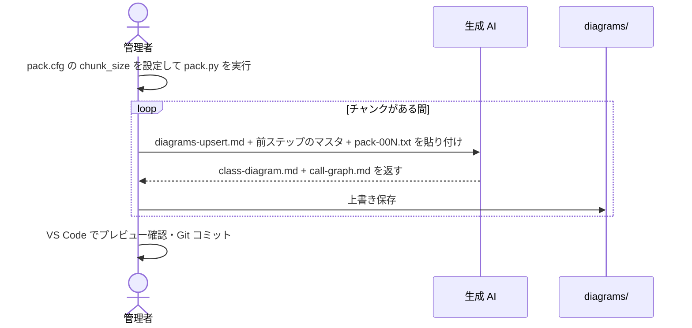

# How-to: チャンク分割して更新する

[diagram-keeper/](../index.md) > how-to


コードが大きく1回の貼り付けに収まらない場合、`--chunk-size` でチャンク分割してから繰り返し投入する。

---

## 概要フロー



---

## 手順

`pack.cfg` の `chunk_size` を設定して実行する:

```ini
[pack]
src = ./src
chunk_size = 50000
```

```bash
python scripts/pack.py
# → pack-001.txt, pack-002.txt, ... が生成される
```

投入手順:

```text
1. pack-001.txt を Upsert → class-diagram.md, call-graph.md を保存
2. 前ステップの出力をマスタとして pack-002.txt を Upsert → 上書き保存
3. 全チャンクが終わるまで繰り返す
4. VS Code でプレビュー確認 → Git コミット
```

各チャンクで AI に貼り付けるもの:

| 項目 | 初回 | 2回目以降 |
| --- | --- | --- |
| プロンプト | `prompts/diagrams-upsert.md` の全文 | `prompts/diagrams-upsert.md` の全文 |
| マスタ2枚 | 既存の `diagrams/` 内のファイル | **前ステップの AI 出力** |
| バンドル | `pack-001.txt` | `pack-00N.txt` |

> チャンクごとに「既存マスタ = 前ステップの出力」を使うこと。初回投入のマスタを使い回すとエントリが失われる。

---

## チャンクサイズの調整

初期値: `chunk_size = 50000`（概ね 10〜30 ファイル相当）

| 症状 | 対処 |
| --- | --- |
| AI がクラスやエッジを取りこぼす / 応答が途切れる | 現在値の 7〜8 割に下げる |
| 往復回数が増えて Upsert の集約ミスが起きやすい | 現在値より上げる |

---

## 関連

← [diagram-keeper/ に戻る](../index.md)

- 通常の更新手順（1回で収まる場合） → [update-diagrams.md](update-diagrams.md)
- pack.py の全オプション → [../reference/pack.md](../reference/pack.md)
- chunk_size の命名とデフォルト値の設計理由 → [../explanation/pack-chunk-size.md](../explanation/pack-chunk-size.md)
