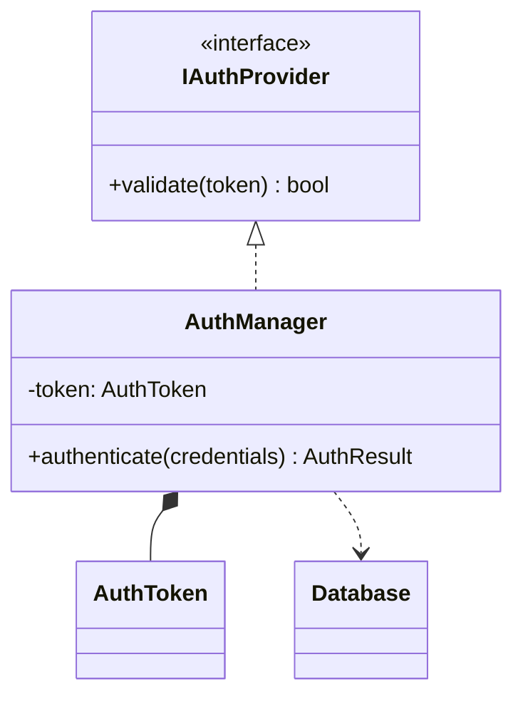
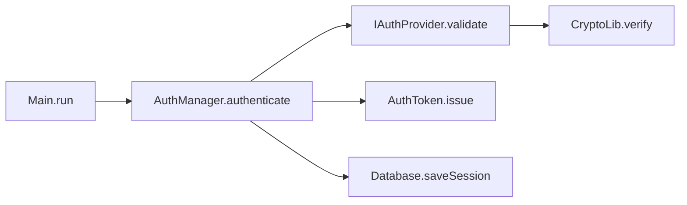

[diagram-keeper/](../index.md) > reference

# Reference: マスタ図仕様

マスタとして管理する2枚の図（クラス図・コールグラフ）の仕様。

---

## マスタ1: クラス図（`diagrams/class-diagram.md`）

| 項目 | 内容 |
| --- | --- |
| 標準 | UML 2.5 構造図 クラス図 |
| Mermaid 記法 | `classDiagram` |
| 表現対象 | クラス・属性（名前・型・可視性）・メソッド（名前・戻り値・引数・可視性）・継承 / 実装 / 集約 / 合成 / 依存 |
| 粒度 | 詳細設計〜実装レベルに統一 |
| 用途 | 既存実装の静的構造把握 |
| スコープ | プロジェクト全体 1 枚を第一目標 |

例:

---

## マスタ2: コールグラフ（`diagrams/call-graph.md`）

> コールグラフは UML 標準外の図。Mermaid の `flowchart` 記法を用いて静的呼び出し関係をマップとして表現する（UML にはメソッド呼び出し関係を網羅的に記述する標準図種が存在しないため）。

| 項目 | 内容 |
| --- | --- |
| Mermaid 記法 | `flowchart LR` |
| 表現対象 | メソッド単位のノード（`ClassName.methodName` 形式）と呼び出し関係（有向エッジ） |
| 粒度 | 呼び出しの有無のみ。時系列・条件分岐・ループ・戻り値は含めない |
| 用途 | 影響範囲調査・シーケンス図派生の入力情報 |
| スコープ | プロジェクト全体 1 枚を第一目標 |
| 外部ライブラリ | 末端ノードとして一段のみ表現（深追いしない） |

例:

---

## 関連

← [diagram-keeper/ に戻る](../index.md)

- プロンプトファイルの仕様 → [prompts.md](prompts.md)
- マスタ分割の手順 → [../how-to/split-diagrams.md](../how-to/split-diagrams.md)
- なぜ2枚構成か → [../explanation/two-diagram-design.md](../explanation/two-diagram-design.md)
