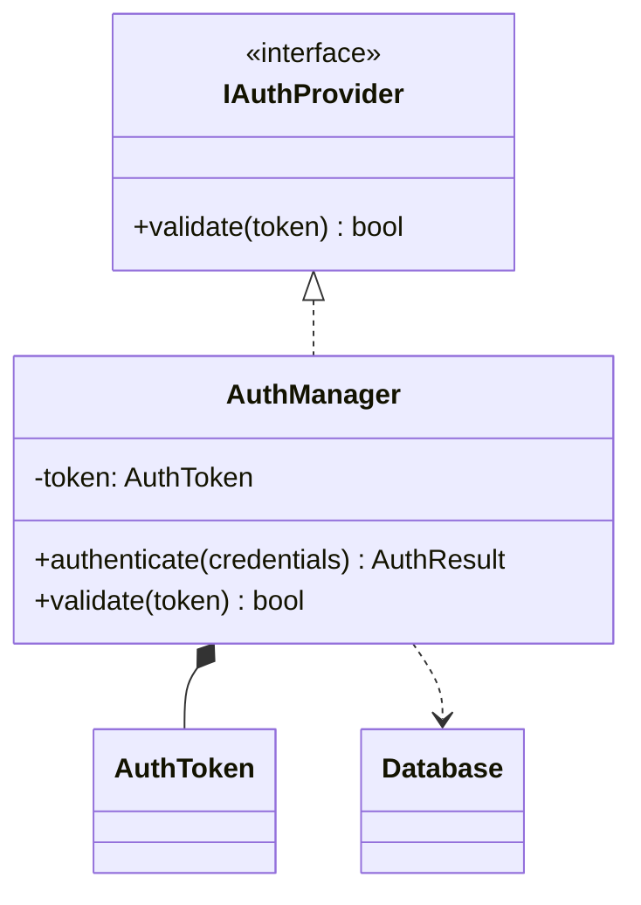

[diagram-keeper/](../index.md) > tutorials

# Tutorial: 初めてのマスタ図作成

`bundle.py` でサンプルコードをバンドルし、AI でクラス図とコールグラフを初めて作る。所要時間: 約 10〜15 分。

前提: Python 3.8 以上・VS Code + Mermaid Chart 拡張（`MermaidChart.vscode-mermaid-chart`）・生成 AI（Claude.ai 等）

---

## Step 1: サンプルコードを用意する

以下の内容で `sample/AuthManager.cpp` を作成する。

```cpp
#include "IAuthProvider.h"
#include "AuthToken.h"
#include "Database.h"

class AuthManager : public IAuthProvider {
private:
    AuthToken token;

public:
    AuthResult authenticate(Credentials credentials) {
        bool valid = validate(credentials.token);
        if (valid) {
            token = AuthToken::issue(credentials);
            Database::saveSession(token);
        }
        return AuthResult(valid);
    }

    bool validate(std::string token) override {
        return CryptoLib::verify(token);
    }
};
```

## Step 2: bundle.py でバンドルする

このツールのルートディレクトリで以下を実行する。

```bash
python scripts/bundle.py --root ./sample --out bundle.txt
```

`bundle.txt` が生成される。中身はこのような MANIFEST 形式になっている。

```text
=== MANIFEST ===
File: AuthManager.cpp
Classes: AuthManager

=== FILE: AuthManager.cpp ===
（ソースコードの内容）
```

## Step 3: AI にプロンプトとバンドルを貼り付ける

生成 AI（Claude.ai 等）の入力欄に以下を **1 メッセージで** 貼り付けて送信する。

1. `prompts/diagrams-upsert.md` の全文
2. 「マスタ未作成」（初回のため既存マスタは不要）
3. `bundle.txt` の全文

> 貼り付け順は問わない。1 回のメッセージにまとめて送信すること。

## Step 4: 応答から 2 ファイルを取り出す

AI の応答に `### file: diagrams/class-diagram.md` と `### file: diagrams/call-graph.md` の 2 つのコードブロックが返ってくる。

1. プロジェクトに `diagrams/` フォルダを作成する
2. 各コードブロック右上のコピーアイコンをクリックしてコピー
3. それぞれ `diagrams/class-diagram.md`、`diagrams/call-graph.md` として保存する

## Step 5: VS Code でプレビューする

1. VS Code で `diagrams/class-diagram.md` を開く
2. コマンドパレット（`Cmd+Shift+P` / `Ctrl+Shift+P`）から「Mermaid: Preview Current File」を実行
3. クラス図が表示されることを確認する
4. 同様に `diagrams/call-graph.md` も確認する

サンプルコードから生成されたクラス図の例:



## 完了

最初のマスタ図が作成できた。

---

## 関連

← [diagram-keeper/ に戻る](../index.md)

- コード変更後にマスタを更新するには → [../how-to/update-diagrams.md](../how-to/update-diagrams.md)
- シーケンス図をオンデマンドで生成するには → [../how-to/derive-sequence.md](../how-to/derive-sequence.md)
- bundle.py の全オプション → [../reference/bundle-py.md](../reference/bundle-py.md)
- マスタ2枚の仕様 → [../reference/diagram-spec.md](../reference/diagram-spec.md)
