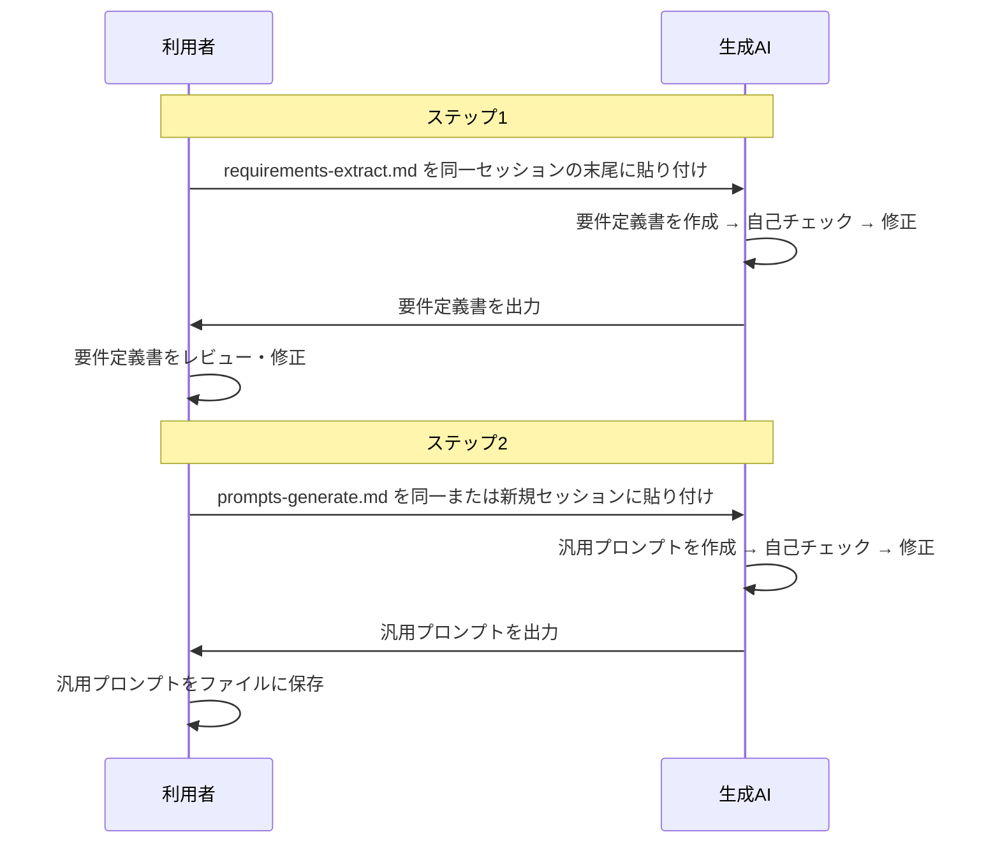

# 解説: 全体フロー

[ドキュメント](../index.md) > 全体フロー

> **Diataxis: Explanation** — prompt-distiller の全体フローと2ステップ構成の概観。

## 関連する解説

- [なぜ同一セッションで実行するか](why-same-session.md)
- [なぜ直接生成ではなく2ステップ構成か](why-two-steps.md)
- [なぜ要件定義書を中間層に置くか](why-requirements-middle-layer.md)

---

[← ドキュメント一覧](../index.md)
