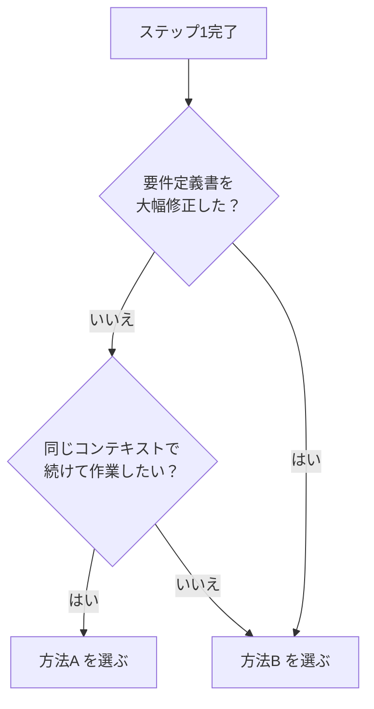

[ドキュメント](../index.md) > 方法A・Bを選ぶ

> **Diataxis: How-to** — ステップ2で同じ会話を続けるか（方法A）、新しい会話で実行するか（方法B）を判断する手順。

# ハウツー: 方法A・Bを選ぶ

ステップ2（`prompts-generate.md`）は2つの実行方法に対応している。以下のフローで選択する。

---

## 方法A を選ぶ場合

**条件:** 以下をすべて満たすとき

- ステップ1の要件定義書に大きな修正をしていない（軽微な編集のみ）
- ステップ1を実行した会話をそのまま継続したい

**手順:** ステップ1を実行した会話の末尾に `prompts-generate.md` の全文を貼り付けて送信する。要件定義書はすでに会話履歴に含まれているため、追加のコピーは不要。

**利点:** 操作が最小限（貼り付けるだけ）。会話の文脈（背景・ニュアンス）がステップ2にも引き継がれる。

---

## 方法B を選ぶ場合

**条件:** 以下のいずれかに当てはまるとき

- ステップ1の要件定義書を大幅に書き直した
- 新しいコンテキストで実行したい（余分な会話履歴を除外したい）

**手順:** `prompts-generate.md` の末尾にある `## 要件定義書` セクションに、修正済みの要件定義書を貼り付けてから新しい会話に送信する。

**利点:** 修正後の要件定義書のみを入力として使うため、ステップ1の古い文脈に引きずられない。

---

[← ドキュメント一覧](../index.md)
