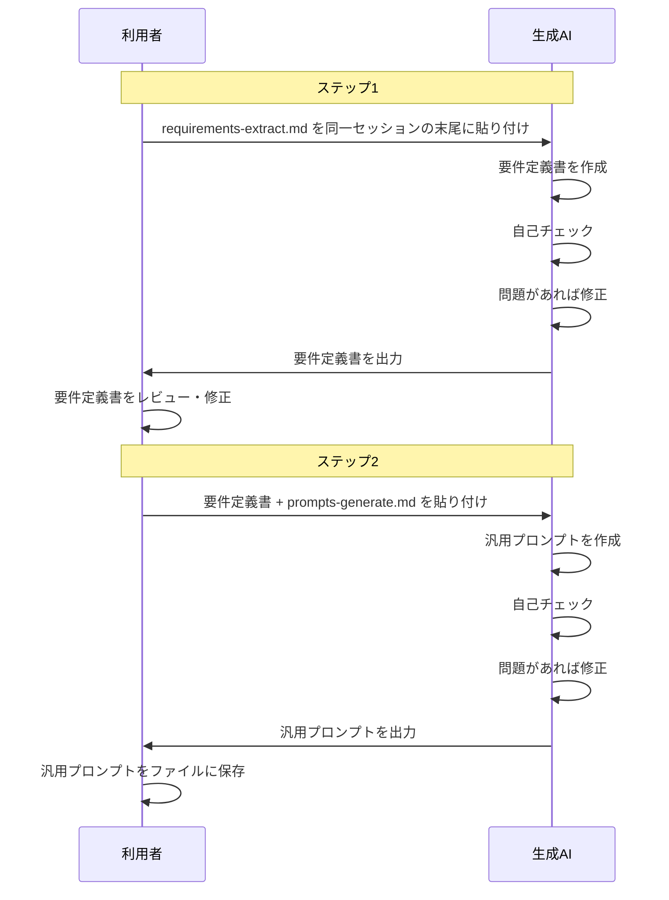

# 要件定義書: 会話からの汎用プロンプト蒸留ツール（prompt-distiller）

## 1. 背景・目的

生成 AI との会話の中で行った作業を、別の場面でも再現できる汎用プロンプトとして抽出・再利用できるようにする。

プロンプトを直接生成するのではなく、**まず要件定義書を作る**ことを中間ステップとして挟む。
要件定義書が揃えば、あとは「この要件定義書をもとにプロンプトを作って」と AI に渡すだけで完結する。
この「会話 → 要件定義書 → プロンプト」の全体ワークフローを実現するメタプロンプトを構築するのが目的。

## 2. 制約条件

| 項目 | 内容 |
|------|------|
| 利用可能な AI | 生成 AI（UI のみ） |
| API / 外部ツール | 不要 |
| 実行環境 | 生成 AI の UI 上でプロンプトを貼り付けるだけ |

## 3. スコープ

### 3.1 対象タスク

| タスク種別 | 例 |
|-----------|-----|
| テキスト処理 | 要約・翻訳・校正・文章作成 |
| コード関連 | レビュー・リファクタリング・バグ修正・仕様解釈 |
| 分析・評価 | データ分析・比較・リスク評価 |
| 構造化 | 情報整理・アウトライン作成・テンプレート化 |

### 3.2 対象外

| 項目 | 理由 |
|------|------|
| 複数会話の統合 | 1 会話 → 1 要件定義書を基本単位とする |

## 4. 機能要件

### 4.1 全体フロー

### 4.2 ステップ1: 会話 → 要件定義書

IEEE 830 Software Requirements Specification に準拠した要件定義書を生成することを目的として、会話コンテキストを分析する。
要件定義書の各セクションが適切に埋まることが分析品質の基準となる。

#### 要件定義書の構成と分析観点

| セクション | 記述すべき内容 | 会話から抽出する観点 |
|-----------|--------------|-------------------|
| ゴール | このプロンプトが解決する問題・達成する目的 | なぜこのタスクが行われたか（「何をした」ではなく「なぜした」の視点で） |
| アクター | 誰がこのプロンプトを使うか。役割・専門知識レベル・利用シーン | 会話の文脈からユーザーの立場・目的・知識レベルを推定する |
| タスク概要 | 何をするタスクか、一言で | 何をしていたか（要約・翻訳・コードレビュー等） |
| 入力仕様 | ユーザーが提供する情報の種類・形式 | ユーザーが提供した情報の種類・形式（テキスト・コード・データ等） |
| 出力仕様 | 成果物の構造・形式・トーン | AI が生成した成果物の構造・形式・トーン（箇条書き・Markdown・口調等） |
| 制約条件 | 明示的・暗黙的なルール・禁止事項・品質基準 | 明示的・暗黙的な制約条件（文字数・言語・禁止事項・品質基準等） |
| 変数一覧 | 固有値を置き換えたプレースホルダーと説明 | 固有名詞・特定データ・固有コードを `[変数名]` 形式で |

#### 自己チェックと修正

要件定義書を作成した後、以下を確認し、問題があれば修正してから出力する。

| チェック項目 | 確認内容 |
|------------|---------|
| ゴール | 「なぜするか」の視点で記述されているか（「何をするか」に留まっていないか） |
| アクター | 役割・専門知識レベル・利用シーンが具体的に記述されているか |
| タスク概要 | 何をするタスクか一言で明確に表現されているか |
| 入力仕様・出力仕様 | 形式・構造・トーンが具体的に特定されているか |
| 制約条件 | 明示的な制約だけでなく、暗黙の制約も含まれているか |
| 変数一覧 | 固有値がすべて変数化され、プレースホルダーと説明が対になっているか |

### 4.3 ステップ2: 要件定義書 → プロンプト

要件定義書を受け取り、汎用プロンプトとして実装する。
ステップ1で生成した要件定義書の品質が、最終的に生成されるプロンプトの品質を決定する。
ステップ1の出力（要件定義書）はそのままステップ2の入力として使える形式で出力されること。

#### 要件定義書からプロンプトへのマッピング

| プロンプトのセクション | 参照する要件定義書の項目 |
|----------------------|------------------------|
| 用途 | ゴール + タスク概要 |
| あなたの役割 | アクターが必要とする AI の専門性 |
| タスク | タスク概要 + 出力仕様 |
| 入力形式 | 入力仕様 + 変数一覧 |
| 出力形式 | 出力仕様 |
| 制約条件 | 制約条件 |
| 例（省略可） | 変数一覧から例値を当てはめて構成 |
| 注意事項 | 制約条件のうち運用上の注意に相当するもの |

#### 自己チェックと修正

プロンプトを作成した後、以下を確認し、問題があれば修正してから出力する。

| チェック項目 | 確認内容 |
|------------|---------|
| 汎用性 | 固有データが変数化されており、別の場面でそのまま使えるか |
| 完結性 | プロンプト単体で AI が迷わず作業を開始できるか |
| 明確性 | 曖昧な表現がなく、期待する出力が具体的に記述されているか |
| セクション完備 | 用途・役割・タスク・入力形式・出力形式・制約条件が全て埋まっているか |
| 変数名 | 変数名は意味が伝わる名前で記述されているか（日本語・英語どちらでも可） |

## 5. 非機能要件

### 5.1 使いやすさ

- 各ステップのプロンプトを生成 AI に貼り付けるだけで動作する（設定・インストール不要）

### 5.2 移植性

- 特定 AI サービスへの依存なし（Claude / ChatGPT / Gemini 等の主要 UI で動作する）

## 6. 成果物

| ファイル | ステップ | 内容 |
|---------|---------|------|
| `prompts/requirements-extract.md` | ステップ1 | 会話を分析して要件定義書を生成するプロンプト |
| `prompts/prompts-generate.md` | ステップ2 | 要件定義書からプロンプトを生成するプロンプト |

## 7. 未確定事項（改良候補）

- [ ] 分析精度の向上: 暗黙的制約の抽出ロジックを強化する方法の検討
- [ ] Few-shot 例の自動提案: 会話から良い例を自動抽出する手順の追加
- [ ] 出力セクションの取捨選択: タスク種別ごとに不要セクションをスキップする判断ロジック
- [ ] 多段階プロンプト対応: 複数ターンにまたがる複雑な作業の抽出方法

## 8. 成功条件

- ステップ1のプロンプトを貼り付けるだけで IEEE 830 準拠の要件定義書が生成される
- 要件定義書が人間にとってレビュー・修正しやすい形式になっている
- ステップ2のプロンプトに要件定義書を渡すだけで汎用プロンプトが完成する
- 生成されたプロンプトが自己チェックの全項目を満たしている
