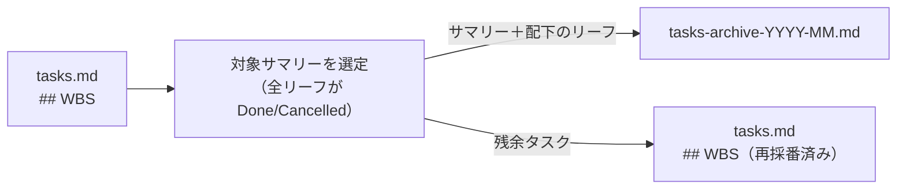

# アーカイブのデータフロー

完了したサマリーを `tasks.md` から切り出し、アーカイブファイルに移動する処理の設計。

## データフロー

## アーカイブ対象の選定

配下のリーフタスクがすべて `Done` または `Cancelled` になったサマリータスクを対象とする。サマリータスク本体と配下のリーフをまとめて移動する。

## アーカイブファイル

| 項目 | 仕様 |
| --- | --- |
| 命名 | `tasks-archive-YYYY-MM.md`（アーカイブ実行月） |
| 形式 | `tasks.md` の WBS テーブルと同じ Markdown テーブル形式 |
| 追記 | 同月ファイルが存在する場合は末尾に追記する |

## tasks.md 側の処理

アーカイブ対象を WBS テーブルから削除した後、WBS コードを詰め直す（再採番）。`depends_on` は `id` を参照するため、WBS の再採番による影響を受けない。

## id と wbs の役割分担

MS Project の Unique ID / WBS の分離と同じ思想。

| フィールド | 役割 | アーカイブ後 |
| --- | --- | --- |
| `id` | 不変の識別子。`depends_on` が参照する | 欠番のまま変えない |
| `wbs` | 構造上の位置。可読性のために使う | 詰め直す |

`depends_on` が `id` を参照することで、WBS の再採番が依存関係を壊さない。

---

← [ドキュメント一覧](../index.md)
