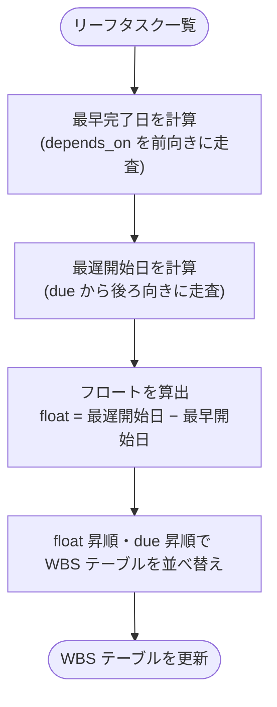

# CPMによる優先順位の自動決定

## 概要

task-streamliner は**クリティカルパス法（CPM: Critical Path Method）**を用いて、タスクの実行順序を自動決定する。`depends_on`・`due`・`estimate` の3フィールドを入力とし、**リーフタスク**に対して計算を適用する。

WBS の詳細は [explanation/wbs.md](wbs.md) を参照。

## 適用範囲

CPM はリーフタスクのみに適用する。サマリータスクの status は子タスクから導出されるため、CPM の計算対象外。

## CPM 計算フロー

上位に並ぶタスク（float が小さいほど重要）が実行優先度の高いタスク。

## estimate が未入力の場合

`estimate` がないリーフタスクはフロートを正確に計算できない。AIは以下を実行する。

1. 不足しているリーフタスクをユーザーに通知する
2. 暫定値（`—`）のタスクは `due` の近い順に並べ、フロート計算済みタスクの後に配置する

## priority フィールドを廃止した理由

手動の `priority` は設定がユーザーの主観に依存し、CPM が計算する客観的な順序と矛盾することがある。`depends_on`・`due`・`estimate` から計算される順序はタスク間の関係から**自然に決まる**ため、手動設定より信頼性が高い。

---

← [ドキュメント一覧](../index.md)
