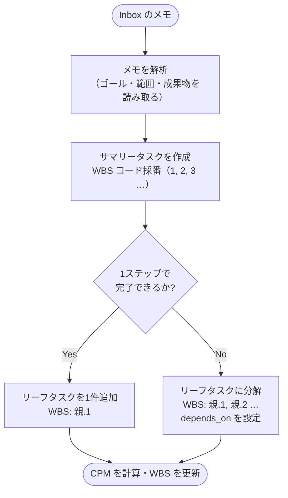

# Inbox 処理のフロー

Inbox のメモを WBS タスクに変換する AI のセッション開始時の処理フロー。

## 処理ステップ

1. **解析** — メモからゴール・範囲・成果物を読み取り、サマリータスクを作成する
2. **分解** — 1ステップで完了できない場合はリーフタスクに分解し、`depends_on` を設定する
3. **補完** — 各リーフタスクの `due`・`tags`・`estimate` を補完する（不明な場合は推測し、不確かなときはコメントを付記する）
4. **片付け** — 処理済みアイテムを Inbox から削除する。今やらないアイテムは Backlog に移す
5. **CPM 計算** — WBS テーブルを実行優先順に並べ替える

WBS の構造定義は [explanation/wbs.md](wbs.md) を参照。
AIの操作ルール全体は [reference/ai-behavior.md](../reference/ai-behavior.md) を参照。

---

← [ドキュメント一覧](../index.md)
