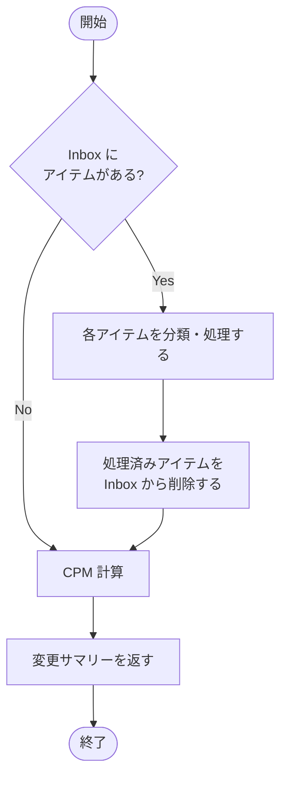
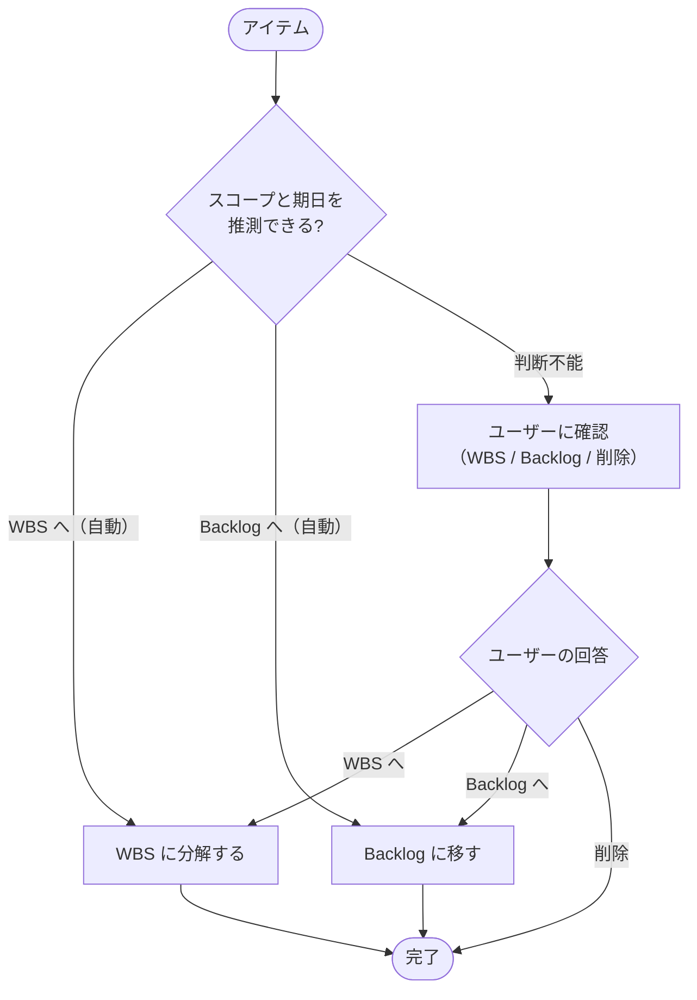
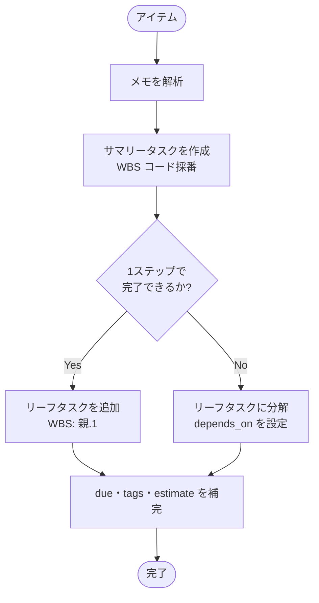

# Inbox 処理のフロー

セッション開始時に AI が Inbox のメモを WBS タスクに変換する処理。

## 全体フロー

CPM 計算の詳細は [explanation/cpm-prioritization.md](cpm-prioritization.md) を参照。

## アイテムの分類

Inbox の各アイテムに対して順に実行する。

| 判断 | 条件 |
| --- | --- |
| WBS へ（自動） | スコープが読み取れ、期日を推測できる |
| Backlog へ（自動） | 「いつかやる」「そのうち」など明示的に先送りの意図がある |
| ユーザーに確認 | スコープまたは期日が不明で推測もできない |

## WBS への分解

WBS に追加するアイテムの詳細処理。

メモの解析では、ゴール・範囲・成果物を読み取る。`due`・`tags`・`estimate` が不明な場合は推測し、不確かなときはコメントを付記する。

WBS の構造定義は [explanation/wbs.md](wbs.md) を参照。
AIの操作ルール全体は [reference/ai-behavior.md](../reference/ai-behavior.md) を参照。

---

← [ドキュメント一覧](../index.md)
