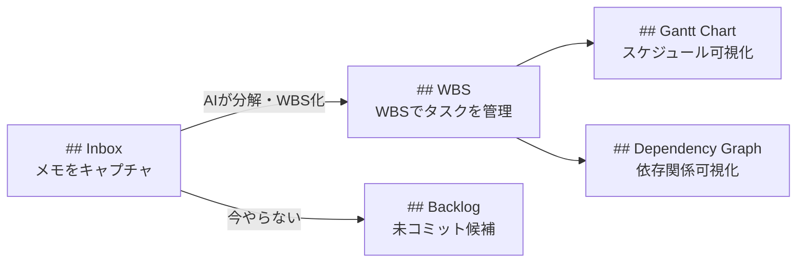

# セクション構成の設計意図

## 全体フロー

## 各セクションの役割

### Inbox — キャプチャ

思いついたことを形式不問で書き留める場所。AIがセッション開始時に処理し、サマリータスクとリーフタスクに分解して WBS に追加する。

詳細は [explanation/wbs.md](wbs.md) を参照。

「Inbox」は GTD 由来の用語だが、メールの受信トレイと同じ感覚で「処理前の入り口」として広く通じるため名称を維持している。Backlog・WBS が WBS + CPM の設計思想に基づく名称に変更されたのと対照的に、Inbox は設計文脈への依存が薄く変更する必要がない。

### WBS — タスク管理

WBS コードで階層化されたタスクテーブル。サマリータスク（ゴール）とリーフタスク（実作業）で構成される。CPM はリーフタスクに適用し、実行順序を決定する。

ステータス遷移は [reference/status-transitions.md](../reference/status-transitions.md) を参照。

### Backlog — 未コミット候補

WBS に入る前の候補置き場。スコープ・期日が定まっていないため CPM の対象外。定期的に見直し、コミットできるものは WBS に昇格する。

**WBS への昇格基準**: スコープ（何をどこまでやるか）と期日（`due`）が定まったタイミングで WBS に移す。どちらか一方でも未定の場合は Backlog に留める。

### Gantt Chart — スケジュール可視化

`due`・`estimate`・`depends_on` をもとにAIが自動生成・更新する。リーフタスクのみを対象とし、クリティカルパスを視覚的に確認できる。

### Dependency Graph — 依存関係可視化

タスク間の `depends_on` 関係をグラフで示す。循環依存の発見にも使う。

## 廃止したセクション

| セクション | 廃止理由 |
| --- | --- |
| `## MIT` | WBS テーブルを CPM 順に並べることで代替。二重管理を避けるため廃止 |
| `## Priority Matrix` | CPM が客観的な優先順位を計算するため不要。アイゼンハワーマトリクスとの思想的矛盾も解消 |

---

← [ドキュメント一覧](../index.md)
