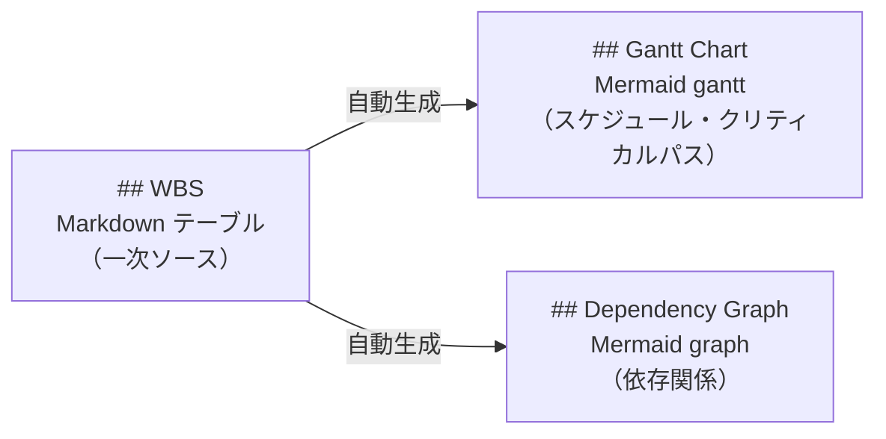

# 可視化の設計

WBS + CPM 設計において表現すべき情報と、その表現手法を定義する。

## 表現すべき情報

| 情報 | 説明 |
| --- | --- |
| 階層構造 | サマリータスクとリーフタスクの親子関係 |
| フロート | 最遅開始日 − 最早開始日。実行優先度の根拠 |
| ステータス | 各タスクの現在の状態 |
| スケジュール | 各リーフタスクの開始日・完了日 |
| クリティカルパス | フロートが 0 のタスク列。遅延するとプロジェクト全体に影響する |
| 依存関係 | タスク間の `depends_on` 関係 |

## 表現手法の対応

| 情報 | 手法 | セクション |
| --- | --- | --- |
| 階層構造 | Markdown テーブル（WBS コードのドット階層） | `## WBS` |
| フロート | Markdown テーブル（CPM 計算順の並び） | `## WBS` |
| ステータス | Markdown テーブル（status フィールド） | `## WBS` |
| スケジュール | Mermaid `gantt` | `## Gantt Chart` |
| クリティカルパス | Mermaid `gantt`（`crit` 修飾） | `## Gantt Chart` |
| 依存関係 | Mermaid `graph` | `## Dependency Graph` |

## 設計の考え方

WBS テーブル（Markdown）が情報の一次ソース。Gantt Chart と Dependency Graph はその二次表現であり、AIが WBS テーブルの内容から自動生成・更新する。

---

← [ドキュメント一覧](../index.md)
