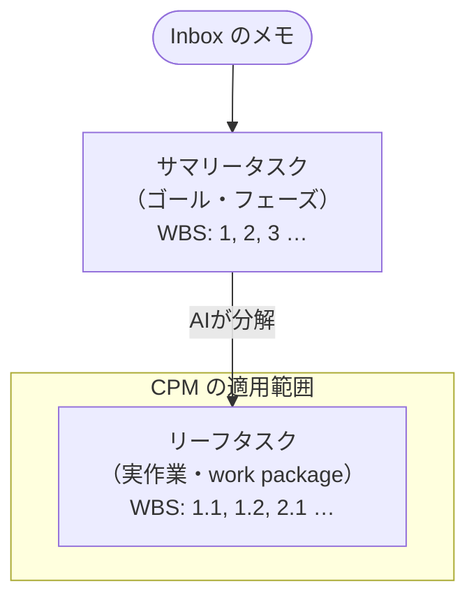
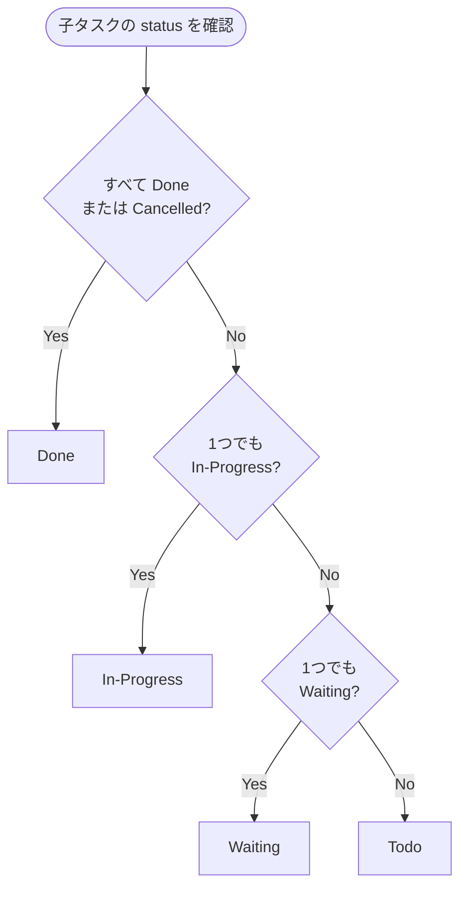

# WBS によるタスク構造

## 概要

task-streamliner の `## WBS` セクションは**WBS（Work Breakdown Structure）**に基づいて構造化する。Inbox に書いたゴールを起点に、AIが作業を階層的に分解し、CPM で実行順序を決定する。

## WBS コード

タスクの階層をドット区切りの番号で表現する。

```markdown
1       発表資料を作る          ← サマリータスク（ゴール）
1.1       構成案を作る          ← リーフタスク（実作業）
1.2       スライドを作成する    ← リーフタスク
1.3       レビュー依頼する      ← リーフタスク
2       本番環境を構築する      ← サマリータスク（別ゴール）
2.1       サーバー設定          ← リーフタスク
2.2       デプロイ確認          ← リーフタスク
```

## サマリータスクとリーフタスク



| 種別 | WBS コード例 | estimate | status | CPM |
| --- | --- | --- | --- | --- |
| サマリータスク | `1`, `2` | 子の合計（自動） | 子から導出 | 対象外 |
| リーフタスク | `1.1`, `1.2` | 入力必須 | 直接管理 | 対象 |

## サマリータスクの status 導出ルール



## depends_on の参照

`depends_on` は `id` で参照する。サマリータスクの `id` を参照した場合、そのサマリー配下のすべてのリーフタスクが完了するまで待ちとみなす。

```markdown
| id | wbs | title        | depends_on |
|----|-----|--------------|------------|
| 1  | 1   | 発表資料を作る | —         |
| 2  | 1.1 | 構成案を作る | —          |
| 3  | 1.2 | スライド作成 | 2          |
| 4  | 1.3 | レビュー依頼 | 3          |
| 5  | 2   | 本番環境を構築する | —      |
| 6  | 2.1 | サーバー設定 | 1          |  ← ゴール1(id=1)が完了するまで待つ
```

`id` は不変のため、WBS をアーカイブ後に再採番しても `depends_on` の参照は壊れない。

Inbox からのタスク分解フローは [explanation/inbox-processing.md](inbox-processing.md) を参照。

---

← [ドキュメント一覧](../index.md)
