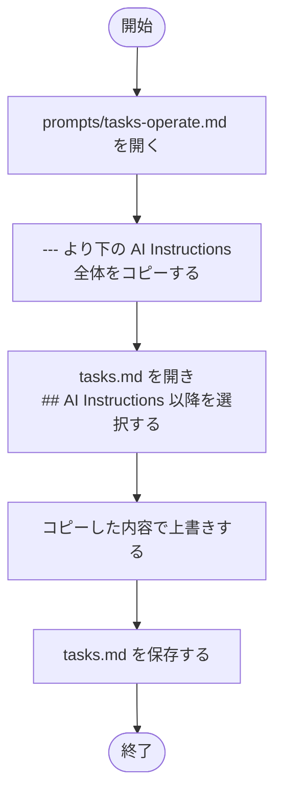
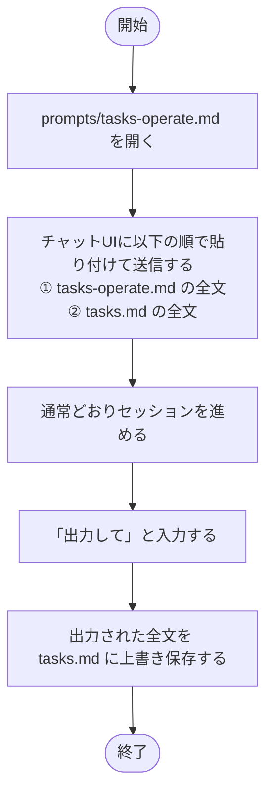

# AI Instructions の復旧

`tasks.md` の末尾にある `## AI Instructions` セクションが破損・消失し、AIが正しく動作しなくなった場合の対処手順。

## 方法 A: テキストエディタで直接修復（推奨）

`prompts/tasks-operate.md` は `templates/tasks.md` の AI Instructions と同一内容を保持している復旧用ファイル。

## 方法 B: AI セッション経由で修復

AI Instructions を含む完全な `tasks.md` が再構成される。Inbox の処理も同時に行いたい場合に適している。

---

← [ドキュメント一覧](../index.md)
