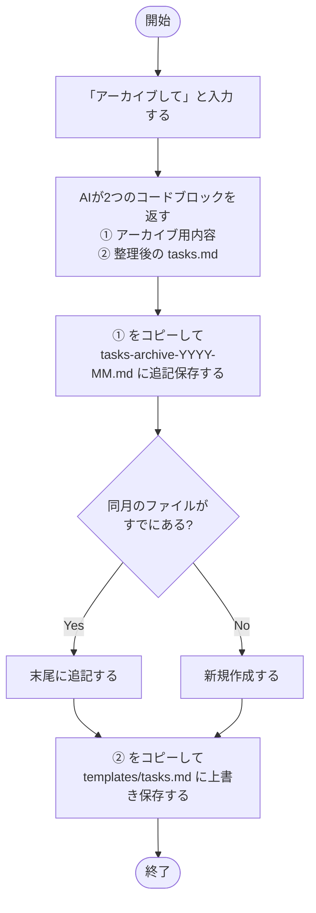

# アーカイブ

`tasks.md` が肥大化してきたら `Done` / `Cancelled` タスクをアーカイブして軽量化する。

```mermaid
flowchart TD
    S([開始])
    E([終了])

    S --> Trigger["「アーカイブして」と入力する"]
    Trigger --> Return["AIが2つのコードブロックを返す\n① アーカイブ用内容\n② 整理後の tasks.md"]
    Return --> CopyArchive["① をコピーして\ntasks-archive-YYYY-MM.md に追記保存する"]
    CopyArchive --> Exists{同月のファイルが\nすでにある?}
    Exists -- Yes --> Append["末尾に追記する"]
    Exists -- No --> New["新規作成する"]
    Append --> CopyTasks
    New --> CopyTasks["② をコピーして\ntemplates/tasks.md に上書き保存する"]
    CopyTasks --> E
```

---

← [ドキュメント一覧](../index.md)
