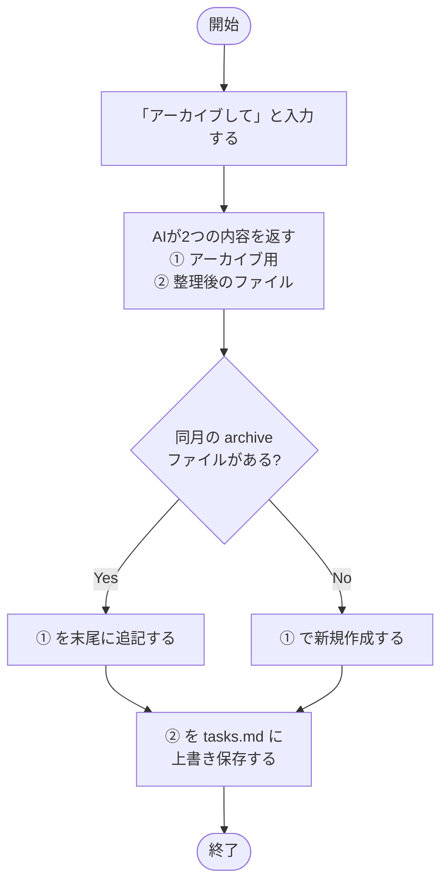

# アーカイブ

`tasks.md` が肥大化してきたら `Done` / `Cancelled` タスクをアーカイブして軽量化する。

| 出力 | 内容 | 保存先 |
| --- | --- | --- |
| ① アーカイブ用 | 対象サマリーとその配下リーフの一覧 | `tasks-archive-YYYY-MM.md`（月単位） |
| ② 整理後のファイル | アーカイブ対象を除いた `tasks.md` 全文（WBS 再採番済み） | `templates/tasks.md` |

アーカイブ対象は**全リーフが Done または Cancelled になったサマリータスク**。サマリーと配下リーフをまとめて移動する。`depends_on` は `id` を参照するため、WBS 再採番後も依存関係は壊れない。詳細は [explanation/archive-dataflow.md](../explanation/archive-dataflow.md) を参照。

---

← [ドキュメント一覧](../index.md)
