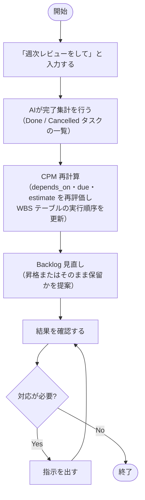

# 週次レビュー

毎週1回、タスクの全体像を見直して翌週の行動計画を立てる。

```mermaid
flowchart TD
    S([開始])
    E([終了])

    S --> Trigger["「週次レビューをして」と入力する"]
    Trigger --> Summarize["AIが完了集計を行う\n（Done / Cancelled タスクの一覧）"]
    Summarize --> Recalc["CPM 再計算\n（depends_on・due・estimate を再評価し\nWBS テーブルの実行順序を更新）"]
    Recalc --> BacklogReview["Backlog 見直し\n（昇格またはそのまま保留かを提案）"]
    BacklogReview --> Check["結果を確認する"]
    Check --> Action{対応が必要?}
    Action -- Yes --> Give["指示を出す"]
    Give --> Check
    Action -- No --> E
```

## 活用のヒント

- Backlog に長期間残っているアイテムは「〇〇は削除して」と整理するとよい
- `estimate` が未入力のリーフタスクがあれば、このタイミングで補完すると CPM の精度が上がる

---

← [ドキュメント一覧](../index.md)
