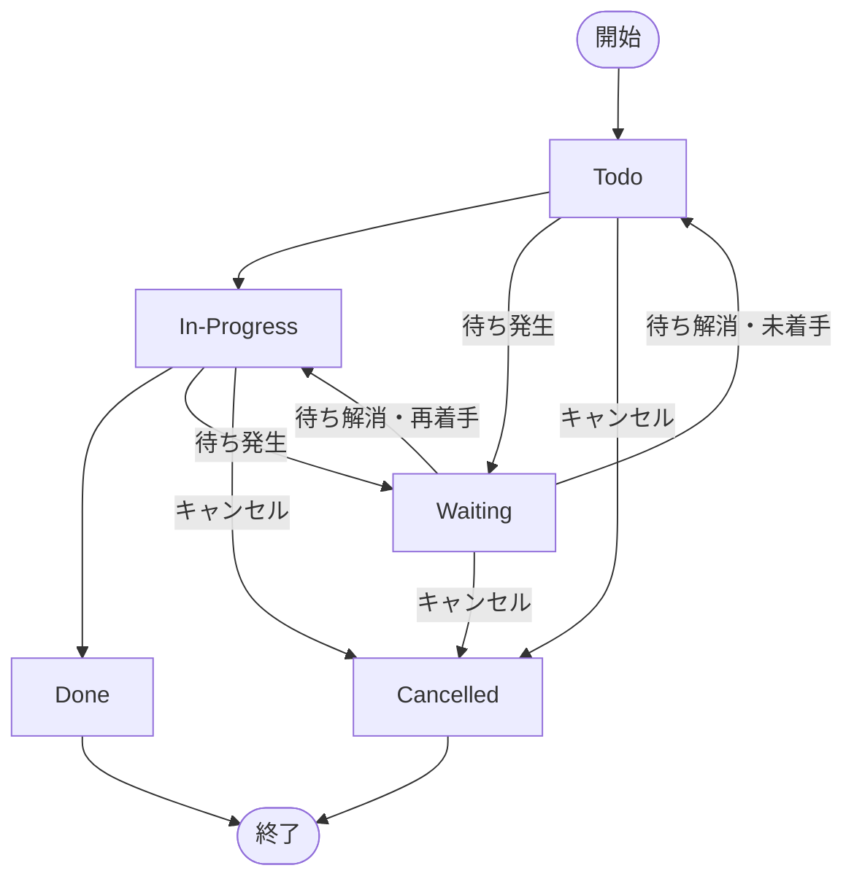

# ステータス遷移

## ステータス一覧

| ステータス | 意味 |
| --- | --- |
| `Todo` | 未着手 |
| `In-Progress` | 作業中 |
| `Waiting` | 待ち（依存タスク未完了・レビュー中・外部応答待ち など） |
| `Done` | 完了 |
| `Cancelled` | キャンセル済み |

## 遷移図

## 補足

- `Waiting` は `depends_on` の未完了だけでなく、レビュー中・承認待ち・外部応答待ちなど任意の「待ち」を表す
- 待ちが解消したとき、未着手に戻す場合は `Todo`、そのまま再着手する場合は `In-Progress` に遷移する
- `Done` / `Cancelled` は終端状態。アーカイブ対象となる
- `depends_on` の詳細は [wbs-fields.md](wbs-fields.md) を参照

---

← [ドキュメント一覧](../index.md)
