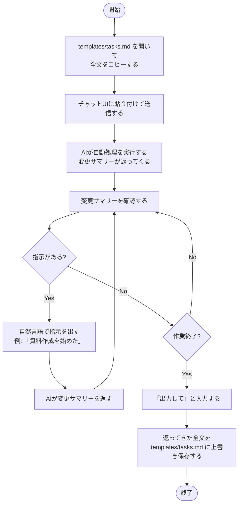

# チュートリアル: 初めてのセッション

`templates/tasks.md` を使って最初のタスク管理セッションを体験する手順。

## 前提

- Claude.ai / ChatGPT 等のチャットUIのアカウント
- テキストエディタ

## セッションのフロー

AIの自動処理の詳細は [explanation/inbox-processing.md](../explanation/inbox-processing.md) を参照。

## 次のステップ

- セッションの外で思いついたことは `templates/tasks.md` の `## Inbox` にメモを書いておくだけでよい。次回セッション開始時にAIが自動処理する
- タスクが増えてきたら [アーカイブ](../how-to/archive.md) を参照

---

← [ドキュメント一覧](../index.md)
