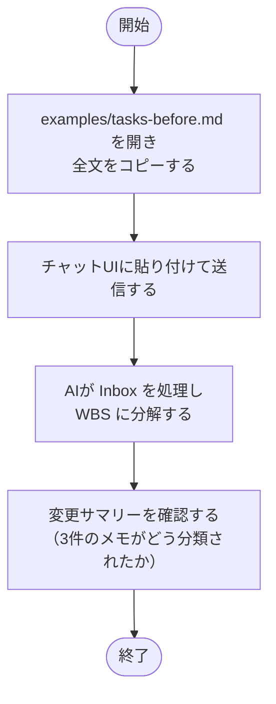
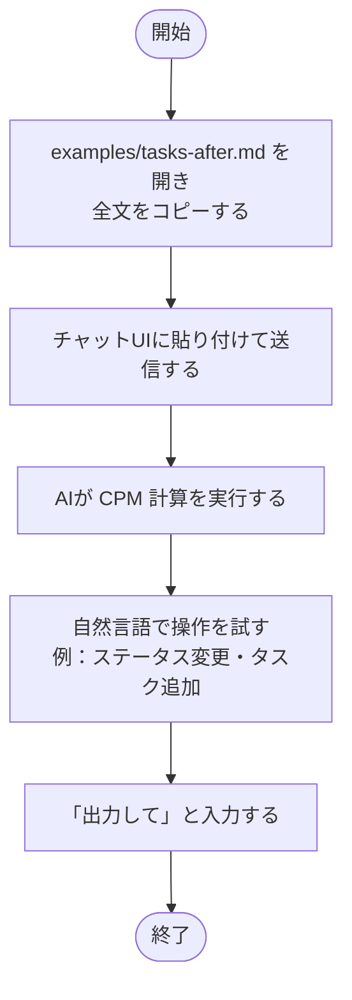

# サンプルファイルで動作を確認する

`examples/` に用意されたサンプルファイルをチャット UI に貼り付けると、
空テンプレートからでは確認しにくい AI の挙動をすぐに体験できる。

## サンプルファイル一覧

| ファイル | 状態 | 確認できること |
| --- | --- | --- |
| [`examples/tasks-before.md`](../../examples/tasks-before.md) | Inbox にメモが3件ある処理前の状態 | Inbox 分類・WBS分解・CPM計算 |
| [`examples/tasks-after.md`](../../examples/tasks-after.md) | WBS が組み上がった処理済みの状態 | ステータス変更・タスク追加などの2回目以降の操作 |

## tasks-before.md で試す

セッション開始時の AI 自動処理（Inbox 処理 → CPM 計算）を確認できる。

Inbox の3件のメモは以下の分類が期待される。

| メモ | 期待される分類 |
| --- | --- |
| 来週の月曜に部門発表があるので資料を作る | WBS へ自動（スコープ・期日が読める） |
| いつか技術ブログを書きたい | Backlog へ自動（先送り意図が明示） |
| 新機能の設計をする | ユーザーに確認（スコープ・期日とも不明） |

## tasks-after.md で試す

WBS が構築済みの状態からセッションを開始し、2回目以降の操作を確認できる。

操作例：

- 「スライド作成を完了にして」
- 「発表後に懇親会の段取りをするタスクを追加して」

---

← [ドキュメント一覧](../index.md)
